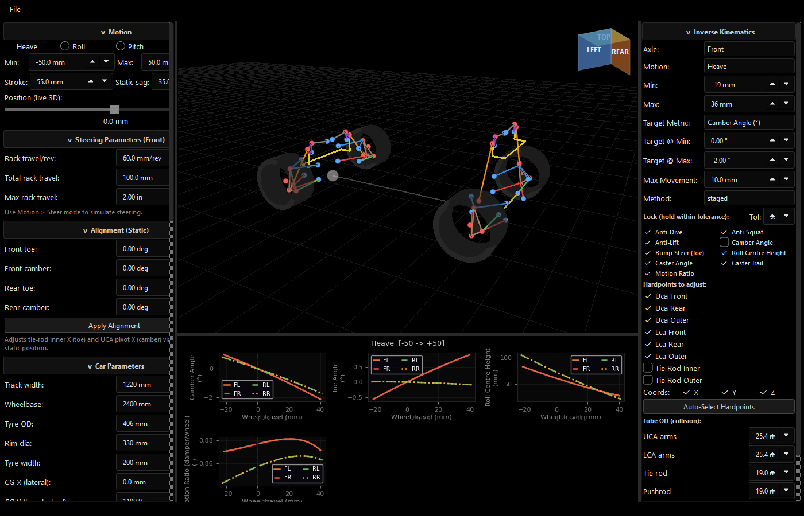
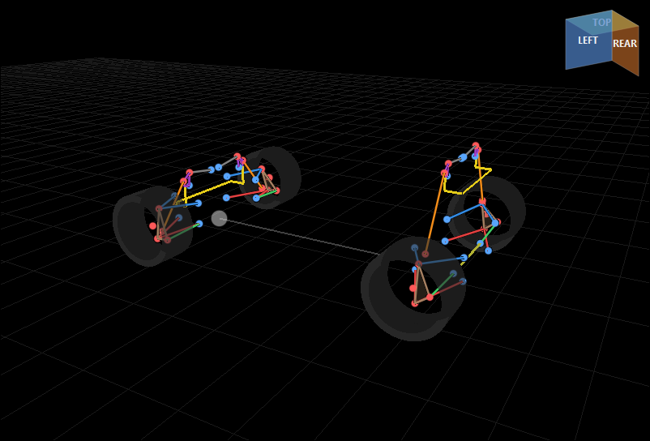
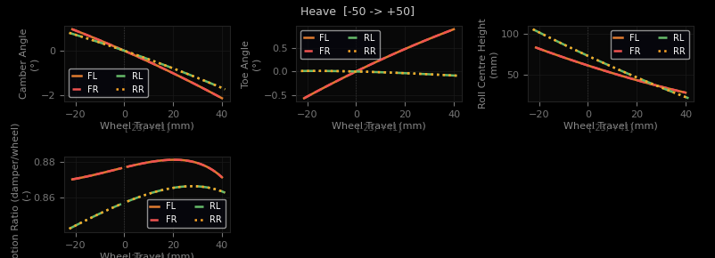
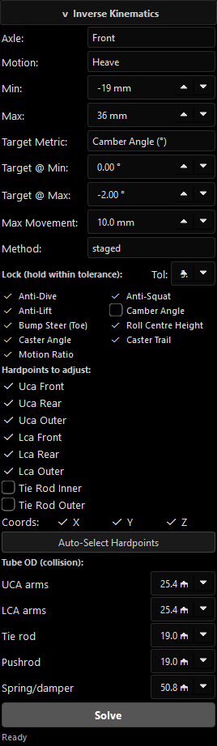
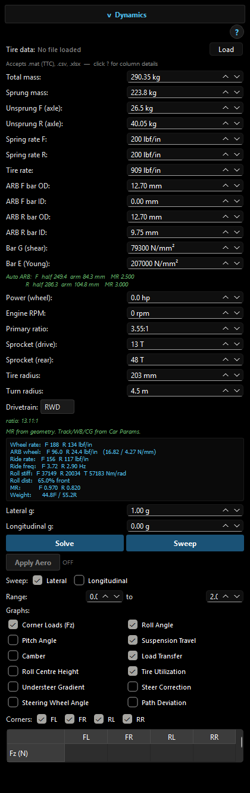
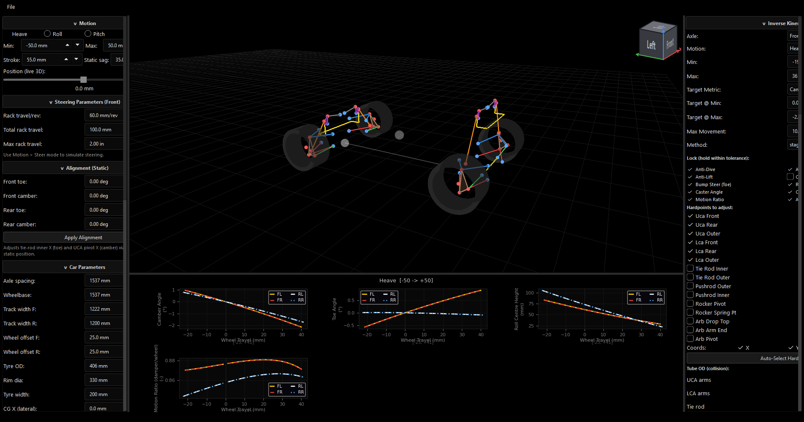
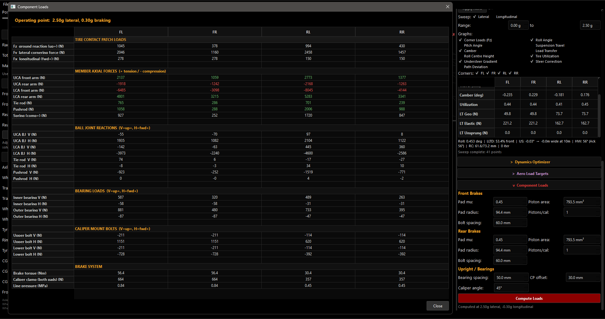

# Vahan

Suspension simulation and optimization software for double-wishbone suspensions with pushrod/rocker actuation. Built for FSAE but applicable to any double-wishbone geometry.

**Version:** 2.0 (Kinematics + Dynamics + Loads)
**Platform:** Python 3.12+ / PyQt6 / NumPy / SciPy



---

## Features

### Forward Kinematics
- Full constraint-based solver (12 simultaneous equations, Newton-Raphson) for double-wishbone + pushrod/rocker
- 30+ kinematic metrics: camber, toe, caster, KPI, roll centre height, anti-dive/squat/lift, motion ratio, scrub radius, mechanical trail, and more
- Heave, roll, pitch, and steer sweep modes
- Four-corner solving with X-mirroring (FL/FR/RL/RR)

### Inverse Kinematics (Optimization)
- Define target curves (e.g. "camber from 0 deg at static to -2 deg at full bump") and let the solver find the hardpoints
- **Staged solver** decomposes the problem using orthogonal variable groups for ~5x speedup over brute-force hybrid DE+LM
- **Widened search** explores solution space at increasing perturbation levels to find alternative geometries
- Collision detection with configurable tube outer diameters — rejects solutions where suspension members intersect

### Steady-State Dynamics
- Load transfer (elastic + geometric + unsprung) with iterative roll convergence
- Degressive tire model with load sensitivity (`C_alpha ~ (Fz/Fz_ref)^n`, n < 1)
- Understeer gradient from back-calculated slip angles
- Friction circle tire utilization per corner
- Roll angle, pitch angle, LLTD

### Sensitivity & Optimization
- Central finite-difference sensitivity of any dynamic output to any vehicle parameter
- Practical step sizes (e.g. 1 mm spring preload, 1 N/mm spring rate)
- Recommendation engine: which parameter changes achieve a target understeer/roll/pitch delta

### Component Loads
- 6x6 static equilibrium on upright free body for all member axial forces
- Ball joint resultant forces decomposed into V (up+) and H (fwd+)
- Bearing loads at inner/outer bearings (V and H) via moment equilibrium including brake friction
- Brake caliper mounting bolt forces (upper/lower, V and H) with direct shear + torque couple
- Separate front/rear brake parameters (pad mu, piston area, pad radius, bolt spacing)
- Brake system: torque, caliper clamp, line pressure

### 3D Visualization
- Interactive OpenGL viewport (VisPy) with full-car wireframe rendering
- Colour-coded suspension members (UCA, LCA, tie rod, pushrod, rocker, spring/damper)
- Roll centre and roll axis overlays
- Click-to-select hardpoint editing

### Kinematic Curves
- Live metric plots across wheel travel for all four corners
- Configurable graph selection from the full metrics catalog

---

## Architecture

```
vahan/                         GUI (PyQt6)
  hardpoints.py                  main_window.py
  solver.py        <------->     panels.py
  kinematics.py                  view3d.py (VisPy/OpenGL)
  metrics_catalog.py
  analysis.py
  optimizer.py
  tire_model.py
  dynamics.py
  loads.py
```

The `vahan/` package is a pure computation library with zero GUI dependencies. The `gui/` layer wraps it in a desktop application. Either can be used independently.

---

## Coordinate System

```
        Z (up)
        |
        |
        +------ X (lateral, outboard positive for left corner)
       /
      Y (longitudinal, forward positive)
```

- **Origin:** Vehicle centreline (X=0), front axle line (Y=0), ground (Z=0)
- **Units:** Metres internally. GUI displays millimetres.
- **Corners:** FL (left-front, modelled), FR (X-mirrored), RL (left-rear, absolute Y coords), RR (X-mirrored of RL)

### Force Sign Convention

All directional force outputs use V/H:

| Symbol | Axis | Positive direction |
|--------|------|--------------------|
| **V** | Z | UP |
| **H** | Y | FORWARD (towards nose) |

Member axial forces: positive = tension (pulled apart), negative = compression (pushed together).

---

## Hardpoint Geometry



### The 14 Hardpoints

Each suspension corner is defined by 14 points in 3D space (42 scalar coordinates):

**Control Arms (6 points)**
| Point | Description | Role |
|-------|-------------|------|
| `uca_front` | UCA front inboard pivot | Fixed to chassis |
| `uca_rear` | UCA rear inboard pivot | Fixed to chassis |
| `uca_outer` | UCA outer ball joint | Moves with wheel |
| `lca_front` | LCA front inboard pivot | Fixed to chassis |
| `lca_rear` | LCA rear inboard pivot | Fixed to chassis |
| `lca_outer` | LCA lower ball joint | Moves with wheel |

**Steering (2 points)**
| Point | Description | Role |
|-------|-------------|------|
| `tie_rod_inner` | Rack end / chassis pickup | Fixed (heave) or translates (steer) |
| `tie_rod_outer` | Upright steer arm pickup | Moves with wheel |

**Wheel (1 point)**
| Point | Description | Role |
|-------|-------------|------|
| `wheel_center` | Hub centre | Moves with wheel (driven by travel) |

**Pushrod/Rocker (5 points)**
| Point | Description | Role |
|-------|-------------|------|
| `pushrod_outer` | Pushrod attachment on arm/upright | Moves with arm |
| `pushrod_inner` | Pushrod attachment on rocker | Moves with rocker |
| `rocker_pivot` | Rocker chassis pivot | Fixed to chassis |
| `rocker_spring_pt` | Rocker end touching spring/damper | Moves with rocker |
| `spring_chassis_pt` | Chassis spring/damper mount | Fixed to chassis |

### Default Values (Front Left Corner, metres)

```
uca_front:       [0.26353, -0.12700,  0.26353]
uca_rear:        [0.23243,  0.12700,  0.24877]
uca_outer:       [0.48260,  0.00912,  0.28598]
lca_front:       [0.21590, -0.11748,  0.12065]
lca_rear:        [0.21590,  0.12342,  0.12700]
lca_outer:       [0.53340, -0.00318,  0.11913]
tie_rod_inner:   [0.21908, -0.06985,  0.15199]
tie_rod_outer:   [0.54293, -0.07303,  0.17145]
wheel_center:    [0.55880,  0.00000,  0.20320]
pushrod_outer:   [0.43815, -0.00318,  0.31953]
pushrod_inner:   [0.25740, -0.00318,  0.64683]
rocker_pivot:    [0.21293, -0.00318,  0.62230]
rocker_spring_pt:[0.20749, -0.00318,  0.67919]
spring_chassis:  [0.01588, -0.00318,  0.66091]
```

Key geometry from Excel:
- Half track: 23 in (584.2 mm)
- Tire diameter: 16 in (406.4 mm), radius 203.2 mm
- Steering ratio: 4.71:1
- Pushrod attached to: UCA (front), LCA (rear)

---

## Forward Kinematic Solver



### The Constraint System

The suspension has **1 degree of freedom** — vertical wheel travel. Given a travel value, the solver finds the positions of 4 moving points (UCA outer, LCA outer, tie rod outer, wheel centre) by solving 12 simultaneous constraint equations.

**The 12 constraints** are all rigid-link length equations:

```
|uca_outer - uca_front|^2  = L1^2     (UCA front arm)
|uca_outer - uca_rear|^2   = L2^2     (UCA rear arm)
|lca_outer - lca_front|^2  = L3^2     (LCA front arm)
|lca_outer - lca_rear|^2   = L4^2     (LCA rear arm)
|lca_outer - uca_outer|^2  = L5^2     (upright: BJ separation)
|tr_outer  - uca_outer|^2  = L6^2     (upright: tie rod to UCA BJ)
|tr_outer  - lca_outer|^2  = L7^2     (upright: tie rod to LCA BJ)
|tr_outer  - tr_inner|^2   = L8^2     (tie rod length)
|wc - uca_outer|^2         = L9^2     (upright: WC to UCA BJ)
|wc - lca_outer|^2         = L10^2    (upright: WC to LCA BJ)
|wc - tr_outer|^2          = L11^2    (upright: WC to tie rod)
wc_z                       = wc0_z + travel   (drive constraint)
```

All link lengths L1...L11 are computed once from the design-position hardpoints and held constant. The 12th equation is the drive constraint that imposes the wheel travel.

### Newton-Raphson Solver

```
x_{k+1} = x_k - J(x_k)^{-1} * F(x_k)
```

- `x` = 12-vector `[uca_outer(3), lca_outer(3), tr_outer(3), wheel_center(3)]`
- `F(x)` = 12-vector of constraint residuals
- `J(x)` = 12x12 analytical Jacobian (no finite differences)

**Key features:**
- **Analytical Jacobian** — Each row of J is the gradient of one constraint. For distance constraints `|a-b|^2 = L^2`, partials are `2*(a_i - b_i)`.
- **Warm-start** — Previous travel step's solution seeds the next. Convergence in 3-5 iterations (vs 15+ cold).
- **Two-pass sweep** — Sweeps outward from design position in both directions so the warm-start chain is always continuous.
- **Tolerance:** 1e-10 on residual norm.

### Rocker Solver

After the main 12-DOF solve, a separate 1-DOF Newton-Raphson solves the rocker angle. The pushrod outer point moves with the arm; the rocker must rotate to keep the pushrod length constant.

**Branch resolution:** The rocker equation has two solutions (rocker can flip). Vahan uses spring-length continuity — the correct branch is the one where the spring length changes smoothly from the previous step.

### Motion Modes

| Mode | What `travel` means | How it works |
|------|---------------------|--------------|
| **Heave** | Vertical wheel displacement (mm) | Direct: `wc_z = wc0_z + travel` |
| **Roll** | Same as heave per corner | Left corner bumps, right droops (or vice versa) |
| **Pitch** | Same as heave per corner | Front bumps, rear droops (or vice versa) |
| **Steer** | Steering wheel angle (deg) | Rack translates `tie_rod_inner` in X by `angle * rack_mm_per_rev / 360` |

---

## Kinematic Metrics


After solving, `KinematicMetrics` computes everything from the 3D point positions:

**Wheel Alignment Angles:**
- **Camber** — Angle of wheel plane vs vertical in front view (XZ). Negative = top leans inboard.
- **Toe** — Steering angle in top view (XY). Positive = toe-in.
- **Caster** — Kingpin axis tilt in side view (YZ). Positive = rearward tilt.
- **KPI** — Kingpin inclination in front view (XZ). Positive = top leans inboard.

**Steering Geometry:**
- **Scrub Radius** — Lateral distance from kingpin ground intercept to contact patch centre (mm).
- **Mechanical Trail** — Longitudinal distance from kingpin ground intercept to contact patch (mm).

**Roll Centre:**
- **IC (front view)** — Intersection of UCA and LCA lines projected into the front-view (XZ) plane.
- **RC Height** — Where the line from contact patch through IC crosses the vehicle centreline. Controls lateral load transfer distribution.

**Anti-Geometry (requires vehicle params):**
- **Anti-Dive %** — Percentage of braking pitch resisted by suspension geometry (front axle).
- **Anti-Squat %** — Percentage of acceleration squat resisted (rear axle).
- **Anti-Lift %** — Percentage of braking lift resisted (rear axle).
- Computed from side-view instant centre position relative to CG height and wheelbase.

**Rocker/Spring:**
- **Motion Ratio** — `d(spring_length) / d(wheel_travel)`. Dimensionless. Relates wheel rate to spring rate.
- **Spring Length** — Current spring/damper length (m).
- **Rocker Angle** — Rocker rotation from design position (deg).

### Metrics Catalog

All 30+ metrics are registered in `metrics_catalog.py` with key, display label, unit, category, and evaluation function. This catalog drives the GUI's metric picker, graph selector, and values table automatically.

---

## Inverse Kinematics Solver



### Problem Statement

**Given:** A target metric curve (e.g., camber = 0 deg at -30mm, linearly decreasing to -2 deg at +30mm), plus constraints on other metrics (locks).

**Find:** Hardpoint positions that produce that curve.

### Formulation

The IK solver wraps the forward solver in a least-squares optimization:

```
minimize  sum_i  w_i * ||predicted_i(x) - target_i||^2  +  regularisation
```

- `x` = flat vector of selected hardpoint coordinates (design variables)
- `predicted_i(x)` = forward sweep at 21 travel points, extracting metric i
- `target_i` = desired curve for metric i
- `w_i` = importance weight

**Residual components:**
1. **Target error** — `sqrt(w) * (predicted - target)` per travel point
2. **Tolerance dead-band** — For lock constraints: zero penalty inside +/-tolerance
3. **Regularisation** — Small penalty for moving far from the starting hardpoints
4. **Collision avoidance** — Smooth ramp penalty starting 1mm before tube contact

### Auto-Balanced Weights

When solving with lock constraints (e.g., "change camber but keep toe, anti-dive, RC constant"):

```
primary_weight = n_locks * 10.0    (primary target dominates)
lock_weight    = 1.0               (locks are soft constraints)
lock_tolerance = 5.0               (dead-band in metric units)
```

This prevents N lock constraints from drowning out the single primary target.

### Orthogonal Variable Groups

**Key insight:** Different suspension metrics are controlled by geometrically independent hardpoint subsets. Solving each metric with only its relevant variables prevents cross-contamination.

| Group | Metric | Variables | Why Orthogonal |
|-------|--------|-----------|----------------|
| 1 | Motion ratio | Pushrod/rocker X, Z | Completely independent mechanism |
| 2 | Toe / bump steer | Tie rod Y, Z | Steering linkage only, near-zero cross-talk |
| 3 | Anti-dive/squat/lift | UCA/LCA inboard **Y only** | Side-view pivot tilt, doesn't touch front-view |
| 4 | Camber | UCA/LCA outer **Z**, inboard **Z** and **X** | Front-view IC geometry, doesn't touch side-view |
| 5 | RC height | Same as camber | Coupled with camber through front-view IC |
| 6 | Caster / trail | Outer BJs **Y** | Kingpin fore-aft tilt, minor effect on everything else |

### Staged Solving Strategy

The `staged` method solves metrics sequentially in priority order:

```
1. STAGE: motion_ratio  (pushrod/rocker vars only)
2. STAGE: toe           (tie rod vars only)
3. STAGE: anti_dive     (inboard Y vars only)
4. STAGE: camber        (front-view Z/X vars only)
   ...
5. FINAL POLISH: all variables + all targets (warm-started from staged result)
```

Each stage creates a sub-solver with only that metric's orthogonal variables, solves locally (single LM), updates the working hardpoints, and passes to the next stage. Final polish refines everything together.

**Result:** Same solution quality as multi-start hybrid, but **5-6x faster** because the staged warm-start lands in the correct basin immediately.

### Available Methods

| Method | Description | Speed | When to Use |
|--------|-------------|-------|-------------|
| `staged` | Orthogonal decomposition + polish | Fast (1-2 LM runs) | **Default.** Best for most problems |
| `hybrid` | 5 random LM starts, keep best | Slow (5 LM runs) | Fallback if staged misses |
| `local` | Single LM from current position | Fastest | Good warm-start available |
| `global` | Differential Evolution | Very slow | Desperate, large search space |

### Collision Detection

Every solution is checked for physical feasibility — no two suspension tubes may overlap.

**Members checked:** UCA front/rear arms, LCA front/rear arms, tie rod, pushrod, spring/damper.

**Algorithm:** Exact 3D minimum distance between all non-connected line segment pairs. If `distance < (radius_A + radius_B)`, the solution has a collision.

**Integration:**
- **Penalty in optimizer** — Smooth ramp starting 1mm before contact (weight 2000)
- **Post-solve check** — Hard collision detection on the final result, reported in UI
- **Explore filter** — Colliding solutions rejected from the solution picker

**Default tube diameters (FSAE):**
- UCA/LCA arms: 25.4 mm (1 in)
- Tie rod / pushrod: 19.0 mm (3/4 in)
- Spring/damper: 50.8 mm (2 in)

### Explore (Find Solutions)

When the primary solve can't meet the target within bounds:

1. Initial solve gives a warm-start x vector
2. Explore tries 4 bound levels: 2x, 4x, 7x, 10x the base bound
3. Each level uses warm-start LM from the initial solution
4. Runs in parallel (ThreadPoolExecutor)
5. Colliding solutions are filtered out
6. Remaining solutions presented in a picker dialog sorted by cost

---

## Tire Model

### Linear Tire with Load Sensitivity

`vahan/tire_model.py` provides `LinearTireModel` — a tire with degressive load sensitivity:

```
C_alpha(Fz) = C_alpha_ref * (Fz / Fz_ref) ^ n
```

- `C_alpha_ref` = reference cornering stiffness (N/deg, default 200)
- `Fz_ref` = reference vertical load (N, default 700)
- `n` = load sensitivity exponent (default 0.8)

**Why n < 1 matters:** With n = 1 (linear), the slip angle ratio between front and rear is always 1.0, giving zero understeer gradient regardless of load transfer. Degressive tires (n < 1) produce higher slip angles on heavily loaded tires, creating understeer when the front is more loaded. This is the fundamental mechanism that makes load transfer distribution affect handling balance.

### Key Methods

- `cornering_stiffness(Fz, camber)` — Returns C_alpha at given Fz
- `slip_angle_for_Fy(Fy, Fz, camber)` — Back-calculates slip angle from lateral force
- `peak_mu(Fz, camber)` — Returns peak friction coefficient

---

## Steady-State Dynamics Solver



### Overview

`vahan/dynamics.py` provides `SteadyStateSolver` — computes the vehicle's steady-state response to lateral and longitudinal acceleration. Uses iterative roll convergence with per-corner kinematic state updates.

### Solve Flow

```
Given: lateral_g, longitudinal_g
  1. Static weight on each corner from CG position
  2. Iterate until roll converges (< 0.01 deg change):
     a. Wheel travel from roll angle x track geometry
     b. Solve kinematics at each corner -> RC height, camber
     c. Load transfer (elastic + geometric + unsprung)
     d. Per-corner Fz = static + load transfer
     e. Update roll angle from moment balance
  3. Per-corner Fy from cornering stiffness at dynamic Fz
  4. Per-corner Fx from brake bias (braking) or drivetrain (accel)
  5. Tire utilization = sqrt(Fy^2 + Fx^2) / (mu x Fz)
  6. Understeer gradient = avg front slip angle - avg rear slip angle
  7. Brake torque per corner = |Fx| x tire_radius
```

### Load Transfer Breakdown

Total lateral load transfer per axle = elastic + geometric + unsprung:

- **Elastic** — Through springs/ARBs, distributed by roll stiffness ratio (LLTD). This is the component the engineer can tune with spring rates and ARB stiffness.
- **Geometric** — Through roll centre, proportional to RC height. Controlled by suspension geometry (hardpoint positions).
- **Unsprung** — Direct, proportional to unsprung CG height. Fixed by component mass distribution.

### Longitudinal Force Distribution

- **Braking** (lon_g < 0): Distributed to all 4 corners by front brake bias fraction
- **Acceleration** (lon_g > 0): Distributed to driven wheels only (RWD: rear only, FWD: front only, AWD: all 4)

### SteadyStateResult

Per-corner outputs: `Fz`, `Fy`, `Fx`, `brake_torque`, `travel`, `camber`, `utilization`

Scalar outputs: `roll_angle_deg`, `pitch_angle_deg`, `understeer_gradient_deg`, `lltd_pct`

### Sensitivity Analysis



`DynamicsSensitivity` uses central finite differences:

```
d(output)/d(param) ~ (solve(param + d) - solve(param - d)) / (2d)
```

Each parameter has a practical step size representing a realistic shop adjustment:
- Spring rate: 1 N/mm
- ARB stiffness: 1 Nm/deg
- Brake bias: 2%
- CG height: 5 mm

The recommendation engine finds which parameter changes produce a desired delta in the target metric (e.g., "reduce understeer gradient by 0.5 deg").

---

## Component Loads



### Overview

`vahan/loads.py` computes forces in every suspension member at a given operating condition (lateral g, longitudinal g). All force outputs are decomposed into V (up+) and H (fwd+).

### Member Force Solver (6x6 Equilibrium)

The upright is a free body connected to 6 two-force members:

| Member | From | To |
|--------|------|-----|
| UCA front arm | `uca_front` (chassis) | `uca_outer` (BJ) |
| UCA rear arm | `uca_rear` (chassis) | `uca_outer` (BJ) |
| LCA front arm | `lca_front` (chassis) | `lca_outer` (BJ) |
| LCA rear arm | `lca_rear` (chassis) | `lca_outer` (BJ) |
| Tie rod | `tr_inner` (rack) | `tr_outer` (steer arm) |
| Pushrod | `pushrod_inner` (rocker) | `pushrod_outer` (arm/upright) |

Each member carries only axial force (tension or compression). This gives:
- 3 force equilibrium equations (SFx=0, SFy=0, SFz=0)
- 3 moment equations about LCA outer ball joint

6 equations, 6 unknowns -> exact solution via `np.linalg.solve`.

Applied loads: contact patch forces (Fz, Fy, Fx) + brake torque about the spin axis.

### Ball Joint Reactions (V/H Decomposition)

After solving the 6x6 system, the resultant force at each ball joint is the vector sum of both arm forces:

```
F_UCA_bj = F_uca_front x u_front + F_uca_rear x u_rear
UCA_bj_V = F_UCA_bj[Z]   (vertical, up+)
UCA_bj_H = F_UCA_bj[Y]   (longitudinal, fwd+)
```

This is the force the upright sees at the UCA ball joint — needed for BJ sizing and upright FEA. Similarly computed for LCA, tie rod, and pushrod ball joints.

**Note on force direction:** The axial forces are along each individual arm link (from chassis pickup to ball joint). The ball joint resultant is NOT along the bisection of the two arms, and NOT along the outboard-to-midpoint line. It depends on the individual axial forces and their angles, which change with suspension travel.

### Bearing Loads

Two bearings on the spindle (inner = vehicle side, outer = wheel side) spaced by `l1`. Contact patch forces act at lateral offset `d` from inner bearing. Brake pad friction on the disc adds additional load.

**Moment equilibrium about inner bearing:**

```
F_friction = brake_torque / pad_radius

total_V = Fz + F_friction x sin(theta)
total_H = Fx - F_friction x cos(theta)

bearing_outer_V = total_V x d / l1
bearing_inner_V = total_V x (l1 - d) / l1
bearing_outer_H = total_H x d / l1
bearing_inner_H = total_H x (l1 - d) / l1
```

Where `theta` = caliper angular position from top of disc (CW from outboard view).

### Caliper Mounting Bolt Forces

Two bolts (upper/lower) react the brake friction force on the caliper:

**1. Direct shear** — Friction force V/H components shared equally between bolts

Friction direction on caliper (Newton's 3rd law, reaction to friction on disc):
```
F_cal_H = F_friction x cos(theta)       (fwd+)
F_cal_V = -F_friction x sin(theta)      (up+)
```

**2. Torque couple** — Brake torque reacted as a horizontal force pair between the vertically-spaced bolts:

```
H_couple = brake_torque / bolt_spacing
```

**Combined per bolt:**
```
upper_bolt_V = F_cal_V / 2
upper_bolt_H = F_cal_H / 2 + brake_torque / bolt_spacing
lower_bolt_V = F_cal_V / 2
lower_bolt_H = F_cal_H / 2 - brake_torque / bolt_spacing
```

The upper bolt carries more horizontal load because the brake torque couple adds to the direct shear at the top and subtracts at the bottom.

### Brake System

From known brake torque at the wheel:
```
caliper_clamp = brake_torque / (pad_mu x pad_radius x 2)
line_pressure = caliper_clamp / piston_area   (MPa = N/mm^2)
```

### Input Parameters

**BrakeParams** (separate front and rear):

| Parameter | Default | Unit |
|-----------|---------|------|
| `pad_mu` | 0.45 | -- |
| `piston_area_mm2` | 793.5 | mm^2 |
| `pad_radius_mm` | 94.4 | mm |
| `num_pistons` | 1 | -- |
| `caliper_bolt_spacing_mm` | 60 | mm |

**UprightParams:**

| Parameter | Default | Unit | Description |
|-----------|---------|------|-------------|
| `bearing_spacing_mm` | 50 | mm | Inner-to-outer bearing distance along spindle |
| `cp_offset_mm` | 30 | mm | Contact patch plane offset from inner bearing |
| `caliper_angle_deg` | 45 | deg | Caliper position from top of disc, CW from outboard |

---

## GUI


### Layout

```
+-------------------+----------------------------+--------------------+
|   Left Sidebar    |      Centre 3D View        |   Right Panel      |
|                   |                            |                    |
| Motion Control    |   VisPy/OpenGL rendering   | Matplotlib Graphs  |
| Car Parameters    |   of suspension geometry   | (metric curves)    |
| Front Hardpoints  |                            |                    |
| Rear Hardpoints   |   + NavCube (orientation)  | Values Table       |
| Metric Picker     |                            | (current metrics)  |
| Steering          |                            |                    |
| Inverse Kin.      |                            |                    |
| Dynamics          |                            |                    |
| Dyn. Optimizer    |                            |                    |
| Component Loads   |                            |                    |
+-------------------+----------------------------+--------------------+
```

### Panels (Left Sidebar)

All panels are collapsible sections:

- **MotionPanel** — Heave/roll/pitch/steer mode, travel range, slider, damper stroke/sag
- **CarParamsPanel** — Wheelbase, CG height, track width, brake/drive bias
- **HardpointPanel** (x2) — Edit all 14 hardpoints per corner, load/save
- **GraphPickerPanel** — Select which metrics to plot
- **SteeringPanel** — Rack ratio, travel limits, Ackermann
- **AlignmentPanel** — Static camber, toe, caster display
- **InverseKinematicsPanel** — Target metric, range, locks, method, tube ODs, solve/explore
- **DynamicsPanel** — Lateral/longitudinal g inputs, vehicle params, solve/sweep
- **DynamicsOptPanel** — Target metric delta, sensitivity grid, recommendations
- **LoadsPanel** — Front/rear brake params, upright geometry, compute button, results popup

### 3D View


GPU-accelerated rendering via VisPy:
- Control arms, upright, tie rod, pushrod, rocker, spring rendered as coloured lines
- Rocker angle arc indicator
- NavCube overlay (click faces to snap to front/side/top views)
- Mouse: right-drag orbit, middle-drag pan, scroll zoom

### Grayscale Theme

The entire UI uses a grayscale colour scheme (dark background, grey text/borders). Only the 3D points and graph lines use colour, keeping the focus on the engineering data.

---

## Vehicle Data (2026 Car)

### Vehicle Parameters

| Parameter | Symbol | Value | Unit |
|-----------|--------|-------|------|
| Total mass (car + driver) | m | 290.35 | kg |
| Sprung mass | Ms | 223.8 | kg |
| Unsprung mass (total) | Mu | 66.55 | kg |
| Wheelbase | L | 1530 | mm |
| CG height | hm | 260.63 | mm |
| CG distance from front axle | lm | 841.18 | mm |
| Front track width | Tf | 1221.8 | mm |
| Rear track width | Tr | 1200 | mm |
| Wheel radius | -- | 203.2 | mm |
| F:R weight distribution | -- | 45% / 55% | -- |

### Springs, Dampers & Rates

| Parameter | Front | Rear | Unit |
|-----------|-------|------|------|
| Spring rate | 22.0 | 22.0 | N/mm |
| Motion ratio | 0.97 | 0.82 | -- |
| Wheel centre rate | 17.5-25.8 | 14.8-27.5 | N/mm |
| Tire spring rate | 159.1 | 159.1 | N/mm |
| Damper stroke | 50 | 50 | mm |
| Damping ratio | 0.70 | 0.70 | -- |
| Damper type | Ohlins TTX25 | -- | -- |

### Anti-Roll Bars

| Parameter | Front | Rear | Unit |
|-----------|-------|------|------|
| ARB OD / ID | 12.7 / 9.75 | 12.7 / 9.75 | mm |
| Arm length | 84.3-90 | 104.8 | mm |
| ARB motion ratio | 2.4-2.5 | 2.92-3.0 | -- |
| ARB wheel rate per wheel | 16.8-20.9 | 6.5-10.5 | N/mm |

### Roll & Pitch Stiffness

| Parameter | Value | Unit |
|-----------|-------|------|
| Front roll stiffness (spring + ARB) | 691.6 | Nm/deg |
| Rear roll stiffness (spring + ARB) | 451.8 | Nm/deg |
| Total roll stiffness | 1702.6 | Nm/deg |
| Front roll stiffness distribution | 59.7% | -- |
| Body roll at 1g | 0.8 | deg |
| Pitch stiffness | 739.9 | Nm/deg |
| Roll centre height (front) | 64.36 | mm |
| Roll centre height (rear) | 85.12 | mm |

### Anti-Geometry & Cornering

| Parameter | Value | Unit |
|-----------|-------|------|
| Anti-dive | 18.94 | % |
| Anti-lift | 29.13 | % |
| Anti-squat | 52.98 | % |
| Max lateral g (no downforce) | 1.5 | g |
| Friction coefficient | 1.5 | -- |

---

## File Reference

| File | Purpose |
|------|---------|
| `vahan/hardpoints.py` | Hardpoint dataclass + mirror ops |
| `vahan/solver.py` | 12-DOF Newton-Raphson constraint solver |
| `vahan/kinematics.py` | Metric computation from solved state |
| `vahan/analysis.py` | High-level sweep interface |
| `vahan/metrics_catalog.py` | 30+ metric definitions + dynamics sensitivities |
| `vahan/optimizer.py` | IK solver, orthogonal groups, collision detection |
| `vahan/tire_model.py` | Linear tire model with load sensitivity |
| `vahan/dynamics.py` | Steady-state dynamics solver + sensitivity analysis |
| `vahan/loads.py` | Component force calculator (members, bearings, brakes) |
| `gui/main_window.py` | Main window, steering model, dynamics/loads wiring |
| `gui/panels.py` | All sidebar panels (motion, IK, dynamics, loads, optimizer) |
| `gui/view3d.py` | VisPy 3D rendering + NavCube |
| `app.py` | Entry point |

---

## Collaborators

<!-- Add collaborator names/handles here -->

---

## Installation & Usage

### Requirements

- Python 3.12+
- NumPy >= 1.24
- SciPy >= 1.10
- Matplotlib >= 3.8
- PyQt6 >= 6.6
- VisPy (optional, for 3D viewport)

### Install

```bash
pip install -r requirements.txt
```

### Run

```bash
python app.py
```

The GUI opens with default FSAE hardpoints loaded.

### Workflow

1. **Adjust hardpoints** — Edit coordinates directly in the side panels (mm)
2. **Run sweeps** — Choose heave/roll/pitch/steer and set travel range
3. **View metrics** — Select which kinematic metrics to plot
4. **Inverse solve** — Set target curves, select which hardpoints to adjust, and hit Solve
5. **Explore** — Run widened search to find alternative solutions across the design space
6. **Dynamics** — Set lateral/longitudinal g, solve for load transfer, roll, utilization
7. **Sensitivity** — Analyze which vehicle parameters most affect your target metric
8. **Component loads** — Set brake params and upright geometry, compute forces at operating point
9. **Save/Load** — File menu for JSON geometry files

### Sign Convention Cheat Sheet

| Quantity | Positive means |
|----------|---------------|
| Lateral g | Cornering right (body rolls left) |
| Longitudinal g | Accelerating forward |
| Longitudinal g (negative) | **Braking** |
| V force | Pushing UP |
| H force | Pushing FORWARD (towards nose) |
| Member axial force | Tension (link being pulled apart) |
| Member axial force (negative) | Compression (link being pushed together) |
| Camber | Top of wheel leans outboard |
| Toe | Toe-in (front of wheel points inboard) |
| Caster | Kingpin tilts rearward at top |

---

## License

Personal project by [@the-vedantin](https://github.com/the-vedantin).
