# Vahan

- Suspension kinematics and vehicle dynamics software for double-wishbone suspensions, built for FSAE.
- One solved model drives everything: the 3D view, kinematic graphs, dynamics, loads and the lap simulator all read the same solve.
- Change a hardpoint and every view, graph and number updates together.

**Version:** 2.8
**Platform:** Python 3.12+ / PyQt6 / NumPy / SciPy / VisPy

> ## Topology Support Status — please read
>
> - The **stable, fully-validated** configuration is **pushrod actuation + bellcrank ARB, front pushrod on the UCA, rear pushrod on the LCA**. Every metric, sweep, dynamics and loads path has been exhaustively tested against this topology.
> - **Every other topology is UNDER DEVELOPMENT / BETA**:
>   - Actuation: direct-acting damper, pullrod
>   - ARB: control-arm (drop-link-on-LCA), T-bar
>   - Springing: decoupled twin-bellcrank (heave + roll coilovers), heave-spring + T-bar (3rd spring)
> - Beta topologies have kinematics, 3D, dynamics and loads wired, and they pass the regression net. Hand-calc validation is incomplete. Treat their numbers as indicative.
> - Contributors are encouraged to test these topologies — open an issue or PR.

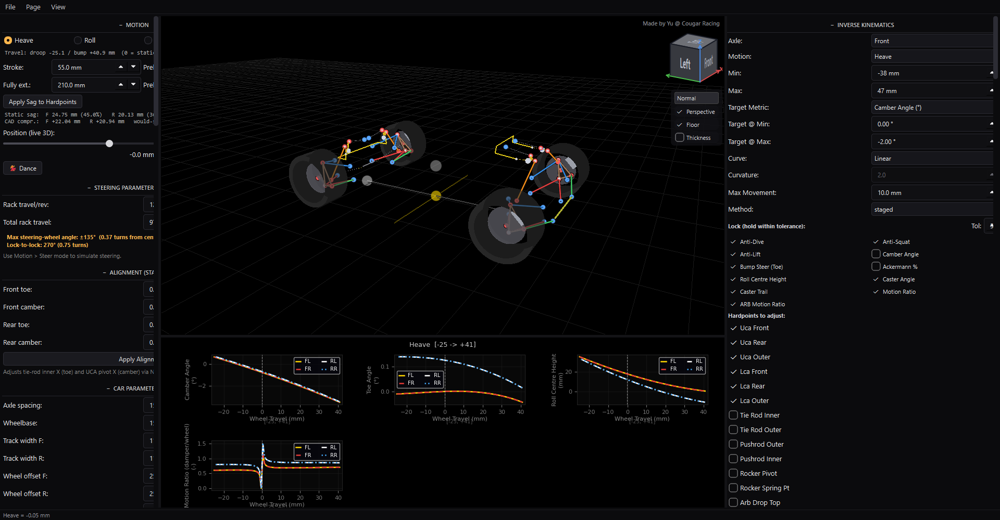

---

## Install and Run

```bash
pip install -r requirements.txt
python app.py
```

- Requirements: NumPy >= 1.24, SciPy >= 1.10, Matplotlib >= 3.8, PyQt6 >= 6.6, VisPy (3D viewport), python-docx + Pillow (report export).

```bash
python test_one_model.py
```

- Runs the regression net offscreen, ~45 s.
- Exit code = number of unexpected failures. 0 means the net passes.

---

## Pages

- The app is organized into five full-window pages (Page menu):

| Shortcut | Page | What it does |
|----------|------|--------------|
| Ctrl+1 | Suspension | 3D view, kinematic graphs, all side panels (the main workspace) |
| Ctrl+2 | Lap Time | quasi-static lap simulator on a digitized track |
| Ctrl+3 | Design City | gallery of candidate designs; click a card to load it into the main window |
| Ctrl+4 | Loads | full-window component-loads page with a live, hoverable 3D force view |
| Ctrl+5 | Ackermann | Ackermann demand / capability / MMD analysis suite |

---

## Kinematics

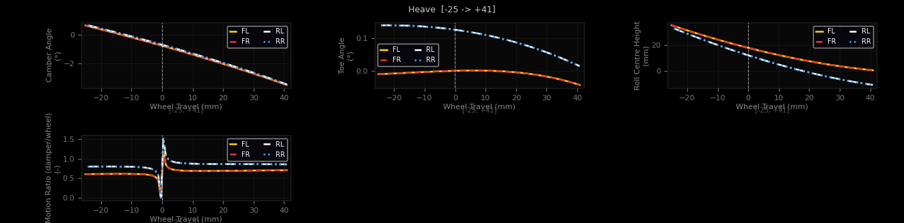

- Each corner is a constraint-based double-wishbone model with 1 degree of freedom (wheel travel).
- The solver finds the 4 moving points (UCA outer, LCA outer, tie-rod outer, wheel centre) from 12 simultaneous rigid-link constraint equations by Newton-Raphson with an analytical Jacobian.
- Warm-started from the previous travel step: 3-5 iterations per step, residual tolerance 1e-10.
- A separate 1-DOF solve turns the rocker to keep the pushrod length constant, with branch selection by spring-length continuity.
- **Motion modes:** heave, roll, pitch, steer (rack translation from steering-wheel angle).
- **Four-corner solving:** FL modelled, FR X-mirrored, RL absolute, RR mirrored.
- **30+ metrics** in `vahan/metrics_catalog.py`: camber, toe, caster, KPI, scrub radius, mechanical trail, roll-centre height (kinematic finite-difference instant centres), anti-dive/squat/lift, motion ratio, spring length, rocker angle, roll-axis inclination, Ackermann %, and more.
- Graphs re-sweep live (debounced 150 ms) while you edit hardpoints.

## 3D View

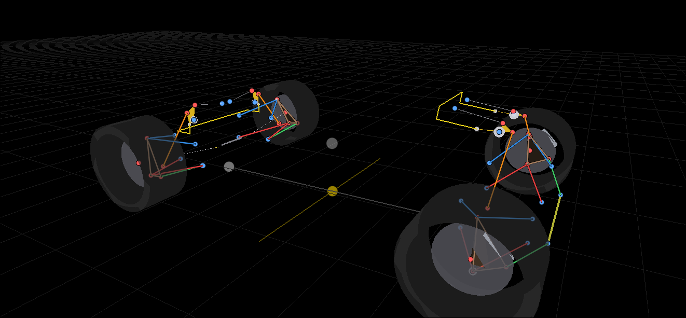

- GPU rendering via VisPy: control arms, upright, tie rod, pushrod, rocker, spring/damper, ARB, driveshaft and tires drawn from the solved model.
- A NavCube (visible in the main-window screenshot) snaps the camera to front/side/top views.
- Right-drag orbit, middle-drag pan, scroll zoom.
- **Interference view** — capsule-vs-capsule minimum distance on every member pair (`vahan/interference.py`); clashing members are flagged visually.
- **Motion level-of-detail** — detail chrome (ball-joint spheres, upright volumes, markers) hides while animating and returns on settle; live motion runs at 12+ FPS.
- Damper travel limits derive from stroke + sag; **Apply Sag to Hardpoints** re-zeroes the model at static compression.
- **Dance** button waves the car corner by corner.

## Topology System

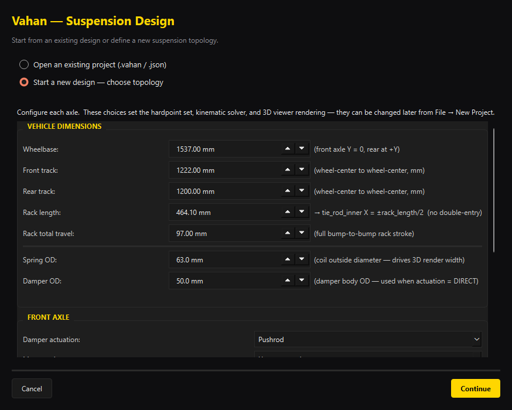

- Every car is defined by four independent per-axle choices: **DamperActuation** {direct, pushrod, pullrod} × **DamperMount** {UCA, LCA, upright} × **ARBType** {bellcrank, control-arm, T-bar, none} × **SpringConfig** {corner, decoupled, heave-T-bar}.
- Front and rear can differ; 69 valid configurations are regression-tested.
- Invalid combinations are rejected with a stated reason: a heave-T-bar spring needs a T-bar ARB, decoupled springs need rocker actuation, and a bellcrank ARB needs a damper rocker for its drop link.
- The startup wizard (or File → New Project) picks the configuration and repopulates default hardpoints, ARB hardware and central mechanisms.

Two of the central-spring options have dedicated solvers:

- **Decoupled twin-bellcrank** (`vahan/monoshock.py`):
  - Each pushrod feeds its own bellcrank; a cross-car heave coilover and a cross-car roll coilover separate the two modes (2-DOF Newton-Raphson).
  - Graph, dynamics and loads rebuild the cradle fresh from current geometry.

  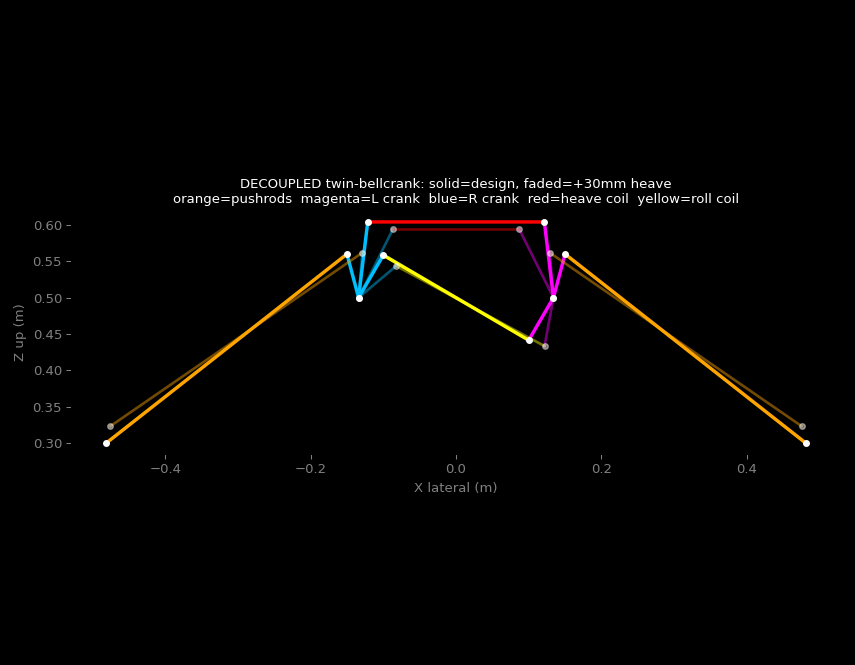

- **Heave-spring + T-bar** (`vahan/heave_tbar.py`):
  - One physical T-bar does both jobs: it pivots about its lateral axis (heave → 3rd spring) and twists about its shaft axis (roll → torsion).
  - Full chain: wheel → pushrod → skewed-plane rocker → drop link → T-bar → 3rd spring.
  - The roll rate derives from the same bar's geometry.

  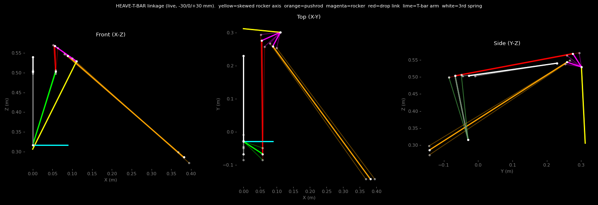

## Hardpoint Editing

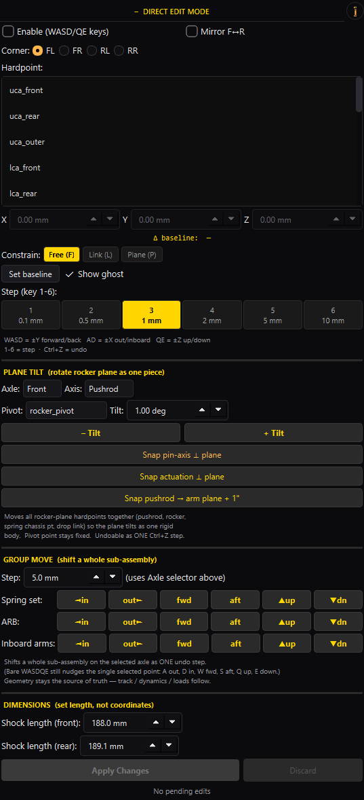

- Direct coordinate entry (mm) per corner, or WASD/QE nudge with 0.1-10 mm steps.
- Mirror F↔R applies the same delta to the matching hardpoint on the other axle.
- **Group move**: shift a whole sub-assembly (spring set, ARB, inboard arms) in/out/fwd/aft/up/down as one undoable step, with the actuation chain re-coplanarized after the move.
- **Plane tilt**: rotate the whole rocker plane about a pivot as one rigid body; snap buttons force the pin axis and actuation chain perpendicular/into the plane.
- Track / wheelbase / offset scaling moves the relevant hardpoint groups together.
- Full undo/redo; geometry is the single source of truth for graphs, dynamics and loads.

### The 18 hardpoints (per corner)

| Group | Points |
|-------|--------|
| Control arms | `uca_front`, `uca_rear`, `uca_outer`, `lca_front`, `lca_rear`, `lca_outer` |
| Steering | `tie_rod_inner` (rack end), `tie_rod_outer` (steer arm) |
| Wheel | `wheel_center` |
| Actuation | `pushrod_outer`, `pushrod_inner`, `rocker_pivot`, `rocker_axis_pt`, `rocker_spring_pt`, `spring_chassis_pt` |
| ARB | `arb_drop_top`, `arb_arm_end`, `arb_pivot` |

## Inverse Kinematics

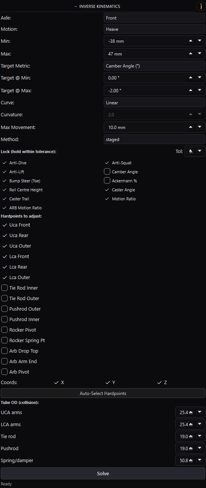

- Define a target metric curve (e.g. camber 0° at static → -2° at full bump) plus locks on other metrics; the optimizer finds hardpoints that produce it.
- **Staged solver** (default): metrics are solved sequentially using orthogonal variable groups (motion ratio → pushrod/rocker only, toe → tie rod only, anti-geometry → inboard Y only, camber/RC → front-view Z/X), then a final polish refines everything together. 5-6x faster than multi-start hybrid.
- Also available: `hybrid` (5 random LM starts), `local`, `global` (differential evolution).
- **Ackermann % target** auto-selects the `rack_position` variable group — moves the inboard rack pickup with the outer ball joint fixed, preserving steering ratio and rack length.
- Steer-mode sweeps are bounded by the physical rack stroke.
- **Collision detection** with configurable tube ODs: smooth penalty inside the optimizer, hard check on the result, and colliding solutions filtered from the Explore picker.
- **Explore** widens the search bounds (2x/4x/7x/10x) in parallel and presents alternative geometries sorted by cost.

## Tire Model

- `vahan/tire_model.py` builds a measured tire from an FSAE TTC `.mat` cornering run.
- A linear degressive model is the fallback when no data is loaded.
- **Single pressure only.** A TTC run sweeps several pressures. Building without picking one pressure is refused; the file's available pressures are listed.
- **Peak-slip clamp.** The rig's ±12° sweep ends before light-load force curves decline, and the raw grid kept paying force for absurd slip. The force table is clamped non-increasing past a per-load peak-slip line whose slope is **measured from pneumatic-trail collapse** in the file's own aligning-moment data. Measured declines pass through untouched.
- Out-of-range loads and slips continue the measured trends; every excursion is recorded.
- Camber rows are kept discrete (TTC tests sweep 0/2/4° inclination); zero/low-load behaviour is extrapolated from the measured trend.
- The Dynamics panel's **Tire / Grip Plots** button opens Fy(α) families, cornering stiffness vs load, Mz(α), and a per-corner friction circle at the current operating point.

*Tire-plot screenshot excluded from the repository — plots derived from FSAE TTC data are not redistributed. Load your own TTC file to see this page. Every screenshot in this README was captured with no tire file loaded, so any tire-derived number shown comes from the fallback linear degressive tire model.*

## Steady-State Dynamics

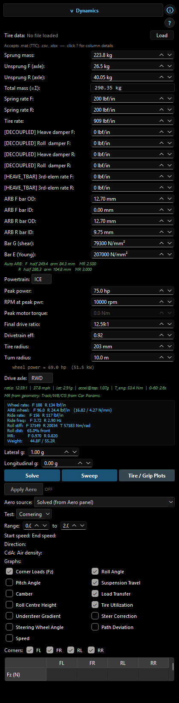

- `vahan/dynamics.py SteadyStateSolver` computes the response to lateral + longitudinal g with iterative roll convergence: wheel travel from roll → kinematics re-solved per corner (RC height, camber) → load transfer (elastic + geometric + unsprung) → per-corner Fz → roll from moment balance, until roll changes < 0.01°.
- Per-corner outputs: Fz, Fy, Fx, travel, camber, friction-circle utilization, brake torque.
- Scalars: roll, pitch, understeer gradient, LLTD; roll uses sprung-CG height for the moment arm.
- ARB wheel rate is derived from bar geometry (G·J/L² torsion + 3·E·I/A³ arm bending in series); hollow bars via OD + ID; blade-section arms supported; arm length, half-length and ARB motion ratio come from the kinematic hardpoints.
- **Drivetrain-aware friction circle**: one traction implementation (`_traction_g_dynamic`, weight-transfer fixed point with load-sensitive μ) serves `max_accel_g`, the acceleration trajectory, and the combined-sweep clamp.
- **Straights mode** integrates a real time-domain trajectory: `F_engine = P/v` minus `F_drag = ½ρ·CdA·v²`, terminating naturally at terminal speed. The longitudinal-g target is literal (0 g = coast).
- Sweep plots carry a secondary speed axis (mph) from the turn radius.

### Sensitivity and Optimization

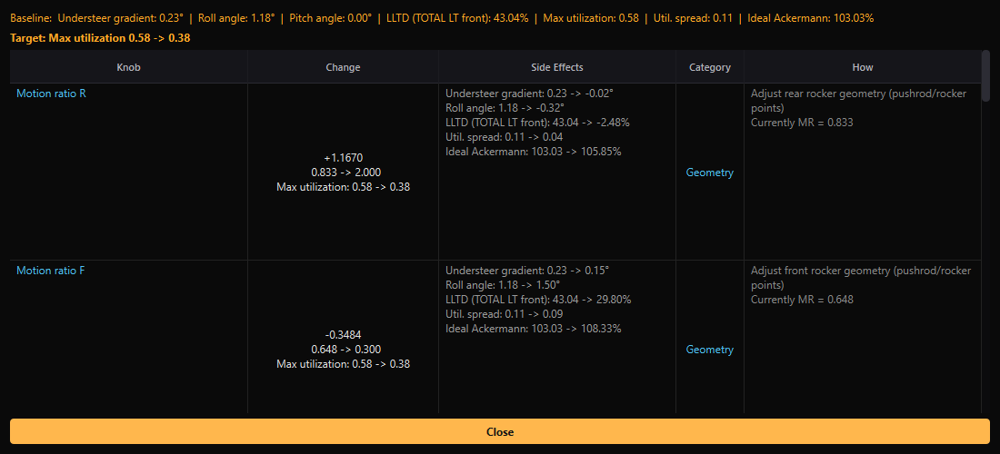

- Central finite-difference sensitivity of any dynamic output to any vehicle parameter, using practical step sizes (1 N/mm spring, 1 Nm/deg ARB, 5 mm CG).
- The recommendation engine lists which knob changes reach a target delta, with side effects.
- Includes **ideal Ackermann %** — tire-model inversion at a given turn radius showing what Ackermann the tires want at that operating point.

## Transient Dynamics

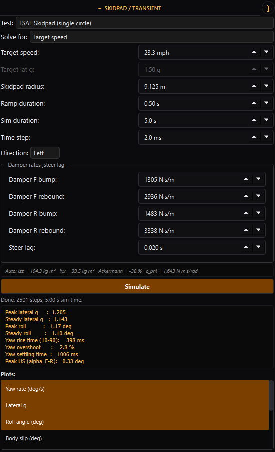

- `vahan/transient.py` — time-domain bicycle + roll model, RK4.
- Test types: FSAE skidpad (single circle or full figure-8), step steer, ramp steer, sine sweep.
- Solve for target speed or target lateral g.
- Per-corner kinematic effects (camber change, RC migration) are precomputed as travel→metric lookup tables at init, keeping the integration loop cheap.
- Body-roll damping derives from the four damper bump/rebound rates through the motion ratio and track.
- Closed-loop path tracking uses a Stanley controller with first-order steer-actuator lag.
- Reported: peak/steady lateral g and roll, yaw-rate rise time / overshoot / settling, peak understeer, plus full time history of any signal via the multi-select plot picker.

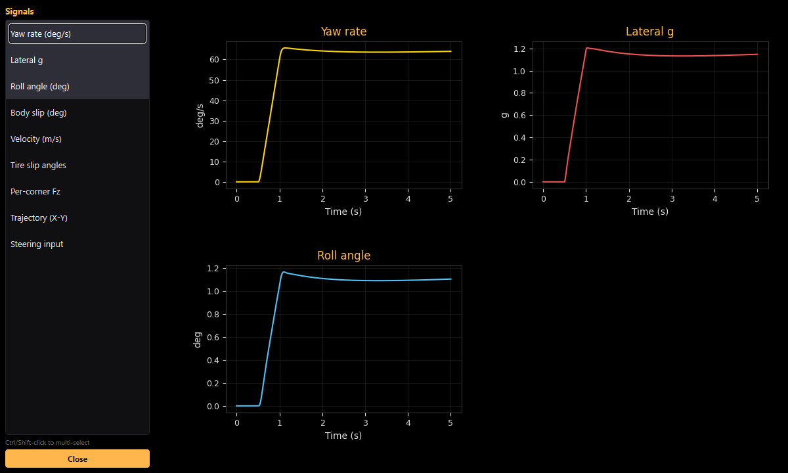

## Ackermann Analysis Page (Ctrl+5)

- Answers two questions from the measured tire surface: how much Ackermann this car wants, and what each setting costs.
- **Demand solver** — per-wheel slip inverted from the tire surface at each wheel's own load share; answers in **degrees** (the buildable spec).
- Saturated states are refused with the message "IMPOSSIBLE — needs X% of grip".
- Percentages use the standard construction: 0% = parallel steer, 100% = turn centre on the rear-axle line, negative = reverse Ackermann (the outer wheel steers more than the inner).
- The demand is capped at the both-wheels-at-own-peak physical bound.
- **Force-ceiling sweep** — front-axle capability vs Ackermann setting with plateau tie bands (no winner declared inside measured noise) and censored-data flags.
- **Full MMD sweep** — a Milliken Moment Diagram per Ackermann setting, each with a numbers box (trimmed limit, attitude/steer at the limit, control, stability, max reach), plus a NUMBERS tab comparing belt-grip and road-grip frames with an explicit verdict line.
- **YMD view** — trim-region zoom reporting RCVD Fig. 8.26 limit parameters per setting (stability index, apex lateral g, plow/neutral/spin character).
- Convention: an unqualified Ackermann % is quoted **at full lock** (the ratio drifts with steer angle).

*Ackermann-page screenshot excluded from the repository — the page displays curves derived from FSAE TTC data, which are not redistributed.*

### One yaw-moment engine

- Every yaw-moment number in the tool — MMD, trim sweeps, comparisons — comes from `vahan/ymd.py`.
- Double-track: per-wheel loads and slip angles including yaw-rate terms.
- Forces are resolved per wheel with the induced-drag couple at ±track/2, the pathway by which steer geometry yaws the car.

## Lap Time Simulator (Ctrl+2)

- `vahan/laptime.py` runs a quasi-static lap on a digitized track (JSON centreline), with corner caps from the full suspension + tire solve.
- **Rotating inertia** (wheels + engine through the gearbox) — on the reference car this alone added +2.0 s (+4.8%) over the point-mass answer.
- **Gearshift model**: torque cut for a dead time, minimum shift interval, decision hysteresis.
- **Real torque-curve support**, with an on-plot label when the assumed fallback curve runs.
- **Per-station Ackermann capability + scrub drag**: each station's front-axle cap and scrub loss come from the trim solve at that station's radius and the current Ackermann setting.
- **Curvature despiking**: a 5-point median filter removes phantom sub-metre "corners" from digitized centrelines.
- Corner summary stats per lap: average/min/max speed, time-weighted and peak lateral g, % of lap cornering, peak accel/brake.
- Graphs: speed trace on the track map, speed vs distance with corner caps, lat/lon g, tire utilization, LLTD, roll, travel + shock, aero, RPM + gear, power, differential yaw moment, ride height.

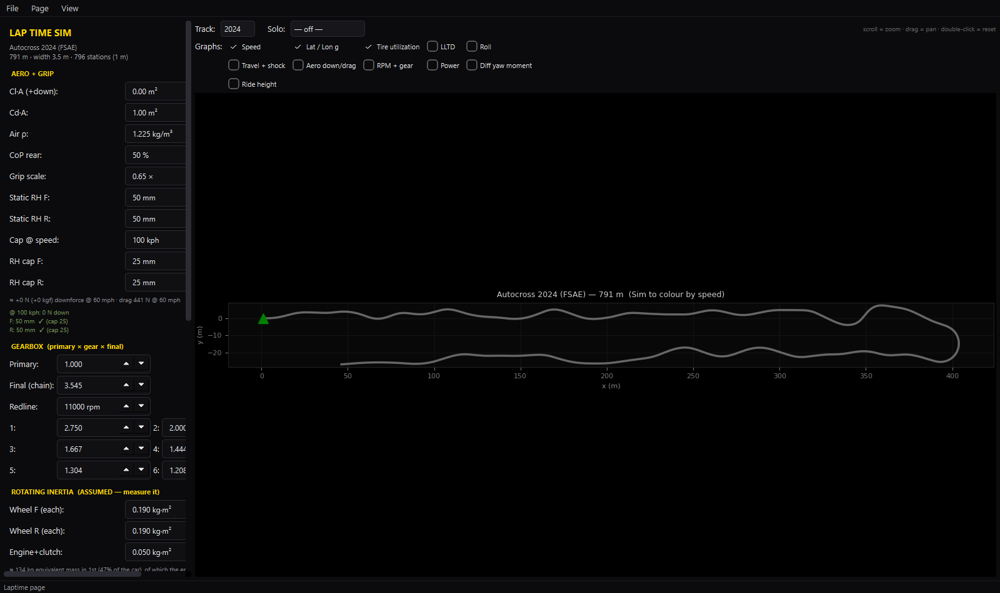

## Aero

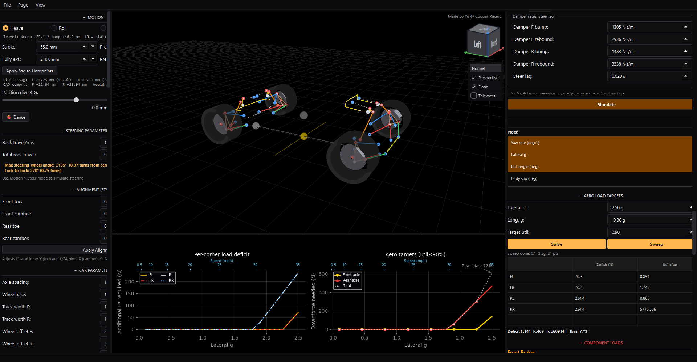

- `AeroDownforceSolver` answers: how much additional Fz does each corner need to bring tire utilization down to a target at a given g?
- Bisection per corner (peak μ is load-sensitive, so grip is nonlinear in Fz); axle-level packaging to the worse corner.
- Outputs: per-corner deficit, front/rear axle need, total downforce, rear aero bias.
- Sweep mode plots deficit vs lateral g.
- Unloaded inner wheels (vertical load near zero) can report utilization far above 1 that no downforce can fix; those cells are diagnostics.

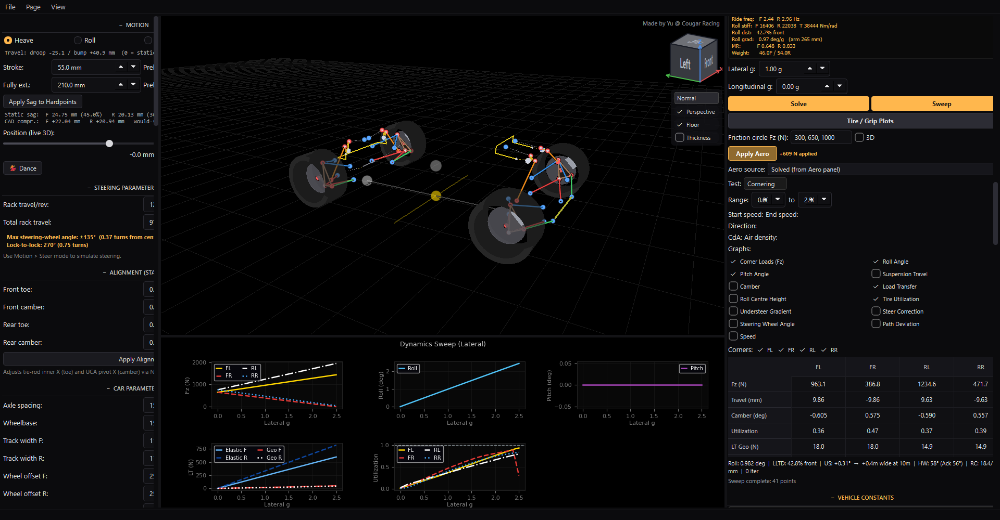

- **Apply Aero** feeds the result back into dynamics, V²-scaled (at constant radius, downforce scales linearly with g).
- Two sources: **Solved** (from the Aero panel) or **Custom** — type CFD/measured `F_ref / V_ref / CoP%` and CL·A is back-calculated, letting you validate handling against CFD numbers directly.

## Component Loads and Brakes

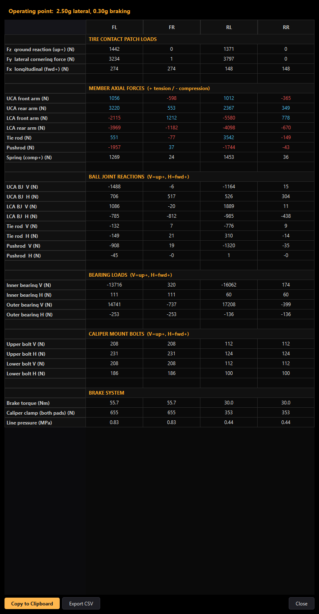

- `vahan/loads.py` solves member forces at any operating point (lateral + longitudinal g).
- **6x6 static equilibrium** on the upright free body → axial force in all six members (UCA front/rear, LCA front/rear, tie rod, pushrod); positive = tension.
- **Ball-joint reactions** decomposed into V (up+) and H (fwd+) — the loads for BJ sizing and upright FEA.
- **Bearing loads** at inner/outer spindle bearings via moment equilibrium including brake friction.
- **Caliper mount bolt forces**: direct shear + torque couple across the bolt spacing.
- **Brake system**: torque, caliper clamp, line pressure, with separate front/rear brake parameters.
- **Brake calculator**: per-corner lockup analysis (which corner locks first, pedal force at lockup) with tire μ pulled from TTC data per corner, plus single-event adiabatic rotor temperature rise.
- The **Loads page** (Ctrl+4) shows all of this on a live 3D force view — select a load case and corner, hover any arrow to read its load; inputs, table and picture all read the same solved model.

## Report Export

- **File → Export Report…** generates a `.docx` of the current solver state (opens cleanly in Google Docs).
- Contents: 3D screenshot, vehicle parameters, heave and roll kinematics, cornering sweep, acceleration and braking trajectories, component loads.
- Each graph gets an auto-generated analysis callout and an editable design-rationale box.
- Runs in a background thread.

## Onshape Export

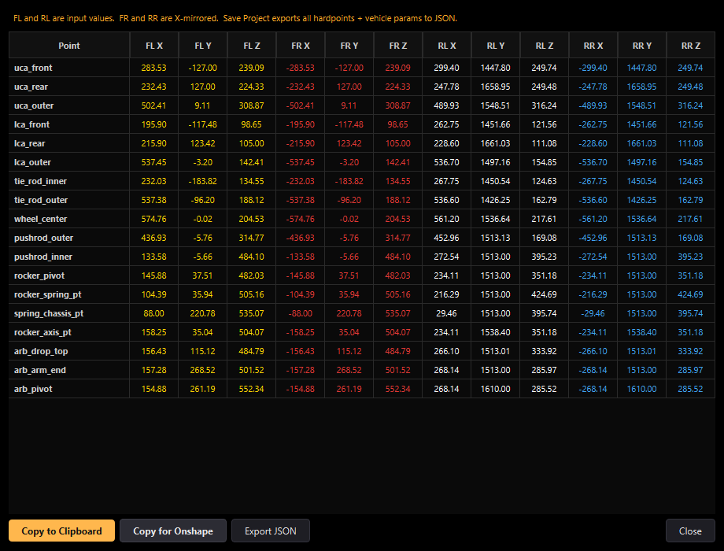

- **View → All Hardpoints** shows all 18 points × 4 corners.
- **Copy for Onshape** produces a pipe-delimited string that the bundled `VahanHardpoints.fs` FeatureScript custom feature parses into up to 72 labelled 3D construction points in a Part Studio (e.g. `FL uca_front`), with per-corner show/hide toggles and manual override mode.
- Copy the feature from the [VahanHardpoints Feature Studio](https://cad.onshape.com/documents/0fd1ba4fa3000364cc5e975c/w/c68fedaa2bfec6c13cd02fce/e/19856db1245e96443584ccac) or from `VahanHardpoints.fs` in this repo.
- Exported values are in mm, same axis convention as Vahan.

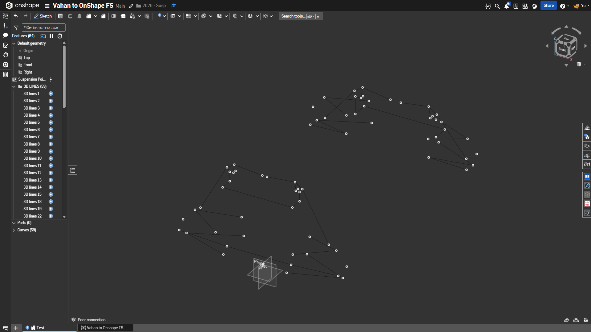

---

## Architecture

- **ONE MODEL invariant:** the 3D view, every kinematic graph, the dynamics, the loads, the lap sim and the Ackermann page all derive from the single solved model.
- Analysis code loads, calls and plots; physics lives in one place.
- The regression net asserts this per topology: actuation chain coplanar, motion-ratio graph responds to the active spring's hardpoint, graph == dynamics at design.

```
vahan/  (pure computation, no GUI imports)     gui/  (PyQt6)
  hardpoints.py   topology.py                    main_window.py   (workspace + wiring)
  solver.py       kinematics.py                  panels.py        (all sidebar panels)
  metrics_catalog.py  analysis.py                view3d.py        (VisPy 3D + NavCube)
  optimizer.py    ik_decoupled.py                laptime_page.py  ackermann_page.py
  tire_model.py   steering.py                    loads_page.py    city_page.py
  dynamics.py     transient.py                   wheel_package.py startup_dialog.py
  ymd.py          ackermann.py
  laptime.py      loads.py
  monoshock.py    heave_tbar.py   tbar.py
  interference.py driveshaft.py   differential.py
  force_opt.py    analysis_plots.py  report_gen.py
```

- The `vahan/` package can be used standalone as a library.

### Coordinate System

```
        Z (up)
        |
        +------ X (lateral, outboard positive for left corner)
       /
      Y (longitudinal, rearward positive: front axle at Y = 0, rear axle at +Y = wheelbase)
```

- Origin: vehicle centreline (X=0), front axle line (Y=0), ground (Z=0).
- Units: metres internally, mm in the GUI.
- Corners: FL modelled, FR X-mirrored, RL absolute Y, RR mirrored.

### Sign Conventions

| Quantity | Positive means |
|----------|---------------|
| Lateral g | cornering right |
| Longitudinal g | accelerating forward (negative = braking) |
| V / H force | up / forward (towards nose) |
| Member axial force | tension (negative = compression) |
| Camber | top of wheel leans outboard |
| Toe | toe-in |
| Caster | kingpin tilts rearward at top |

### Save / Load

- `.vahan` JSON project files round-trip all hardpoints, topology, vehicle parameters, motion settings and every input on the Dynamics, Skidpad, Loads and Aero panels.
- Older geometry-only v1 files still load.

---

## Regression Net

- `python test_one_model.py` — offscreen, ~45 s.
- Roughly 40 gate sections plus a 69-configuration topology sweep.
- Solver bug fixes add a failing-then-passing check; unfixed issues are documented as KNOWN-FAIL and do not fail the net.
- Gates include: per-topology coplanarity and motion-ratio connectedness, real-geometry actuation and clearance checks (ARB drop link vs coilover, pushrod vs ball joints, rocker hardware volumes), tire-model honesty (pressure refusal, camber-row integrity, peak clamp, the >100%-Ackermann preference tripwire), Ackermann solver trust, YMD trim criterion, brake/balance-bar and sag correctness, roll-gradient and ARB-rate sanity with panel/solver agreement, lap-sim honesty, save/load round-trip, load-transfer invariants.
- Exit code = number of unexpected failures.
- The net is a safety net; numeric and visual verification of actual model output is still expected for any change.

---

## Data Policy

- This repository tracks the software only.
- FSAE TTC tire data, tire-derived plots and screenshots showing tire identity are **not** distributed, per TTC data-use rules. Load your own TTC files.
- Default vehicle parameters shipped in the panels are one team's editable example inputs; replace them with your own.

## License

- Personal project by [@the-vedantin](https://github.com/the-vedantin).
- Vahan is provided "as is". The user assumes all risk for component failures, incorrect calculations, or faulty data.
