# Vahan

Suspension kinematics and vehicle dynamics for a double-wishbone race car (Python, PyQt6, VisPy).
One solved hardpoint model feeds the 3-D view, every graph, the dynamics, the loads and the lap
simulation. Built by Cougar Racing for the 2027 FSAE car.

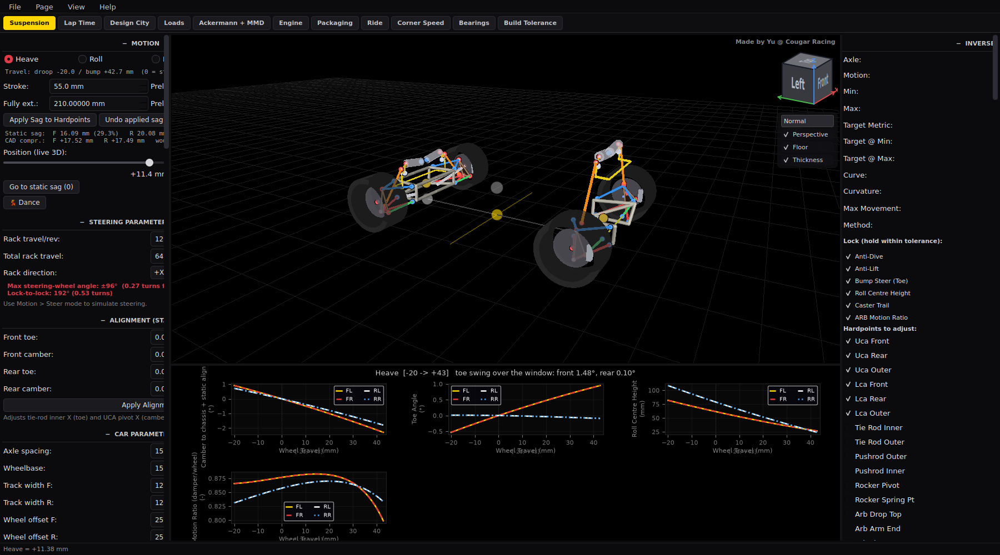

**Testing caveat.** Several suspension topologies are supported, but they have not all been
tested to the same depth. The regression net checks a limited set of properties per topology;
passing it does not mean a topology is comprehensively tested or validated against a car. The
default layout (pushrod, bellcrank anti-roll bars, corner springs) has had the most use.

Screenshots come from the default example model. Most were captured with no tyre file loaded
(parametric fallback tyre); a few analysis results were computed with a measured tyre and are
marked as such. No raw tyre test data or tyre identity appears in this repository.

## Contents

[Install](#install) · [Start a project](#start-a-project) · [Conventions](#conventions) ·
[3-D view](#3-d-view) · [Kinematic graphs](#kinematic-graphs) · [Side panels](#side-panels) ·
[Editing hardpoints](#editing-hardpoints) · [Topologies](#topologies) ·
[Inverse kinematics](#inverse-kinematics) · [Packaging](#packaging) ·
[Clearance checks](#clearance-checks) · [Steady-state dynamics](#steady-state-dynamics) ·
[Tyre model](#tyre-model) · [Aero targets](#aero-targets) · [Sensitivity](#sensitivity) ·
[Transient](#transient) · [Component loads](#component-loads) · [Brakes](#brakes) ·
[Bearings](#bearings) · [Analysis plots](#analysis-plots) · [Ride](#ride) ·
[Lap time](#lap-time) · [Engine](#engine) · [Corner speed](#corner-speed) ·
[Ackermann and yaw moment](#ackermann-and-yaw-moment) · [Build tolerance](#build-tolerance) ·
[Exports and CAD](#exports-and-cad) · [Project files](#project-files) · [Testing](#testing) ·
[Development](#development) · [Credits and license](#credits-and-license)

## Install

Python 3.12 or newer (the regression net uses 3.12 f-string syntax).

```bash
pip install -r requirements.txt
python app.py
```

Required: numpy, scipy, matplotlib, PyQt6, vispy, python-docx, Pillow. Optional: cascadio and
trimesh (STEP import), cadquery-ocp (STEP re-export), mcp (MCP server), pandas and openpyxl
(tyre data from CSV/XLSX), pywin32 (SolidWorks bridge, Windows). On a minimal Linux image also
`apt-get install libegl1 libopengl0`. No hot reload: restart after a code change.

## Start a project

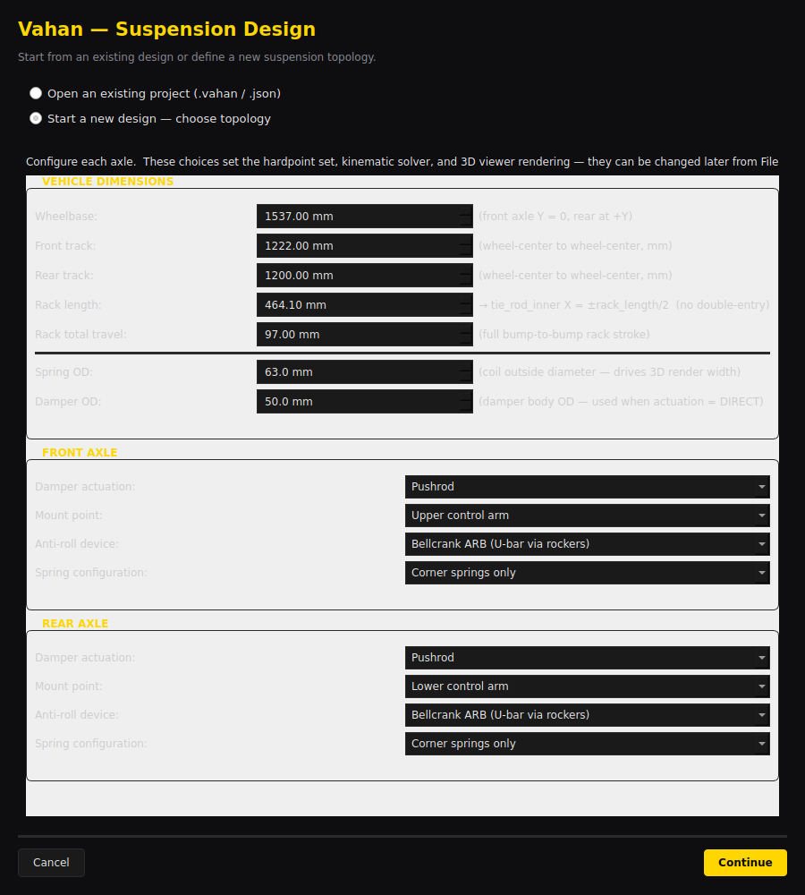

**What:** open a `.vahan` project or start a new design.
**How:** enter wheelbase, tracks, rack length and travel, spring and damper OD, then pick each
axle's actuation, damper mount, anti-roll device and spring configuration; invalid combinations
block *Continue* with the reason. Default hardpoints for the chosen topology are loaded.
**Shortcoming:** the defaults are one example car, not a neutral template.

## Conventions

```
Z up | X lateral, outboard positive for the modelled corner | Y longitudinal, REARWARD positive
origin: centreline, front axle line, ground      metres inside vahan/, mm and degrees in the GUI
```

Positive: camber = top out, toe = toe-in, caster = top rearward, KPI = top inboard, scrub =
kingpin ground point inboard of the patch, trail = patch behind that point, member force =
tension, V/H = up/forward, longitudinal g = acceleration. Lateral g is positive for a
right-hand turn in the steady-state solver and loads (left side gains load); the yaw-moment
and Ackermann modules use left-turn positive and index the solver by |g|.
Only FL and RL are stored; FR and RR are X mirrors. Hardpoints are entered at design ride height
with the wheel centre one tyre radius above ground. The contact patch is the wheel centre dropped
to the ground plane. A few old comments and `examples/fsae_front.py` use a different frame;
`vahan/hardpoints.py` and `vahan/kinematics.py` are authoritative.

## 3-D view


| Front | Side | Top |
|---|---|---|
| 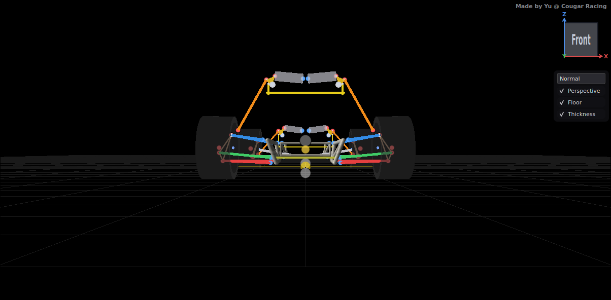 | 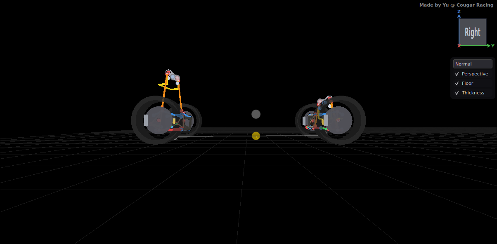 | 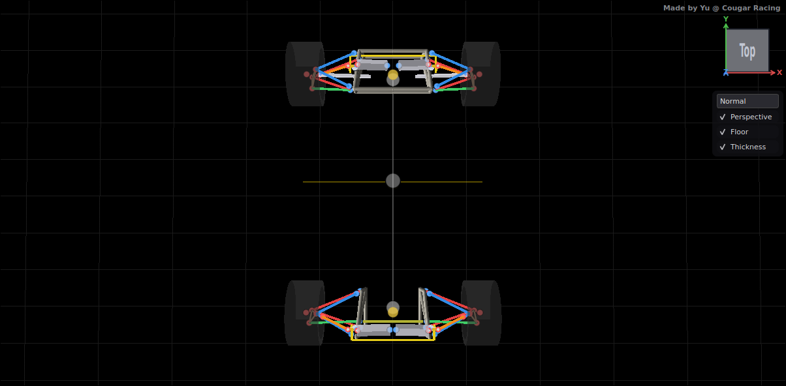 |

**What:** the solved model drawn as solids: arms, upright and ball joints, tie rod, pushrod,
rocker plate, spring at its OD, anti-roll bar, driveshafts, tyres and rim, brake rotor and
caliper, wheel bearings, chassis tubes, roll centres, roll axis, pitch axis, CG, unsprung CG.
**How:** VisPy meshes rebuilt from the corner solve on every slider move; the NavCube snaps the
camera. Left-click picks a point, right-drag orbits, middle-drag pans, wheel zooms.
**Shortcoming:** tube and joint sizes are declared constants, not imported part geometry.

| Heave (bump) | Roll | Pitch | Steer |
|---|---|---|---|
|  |  | 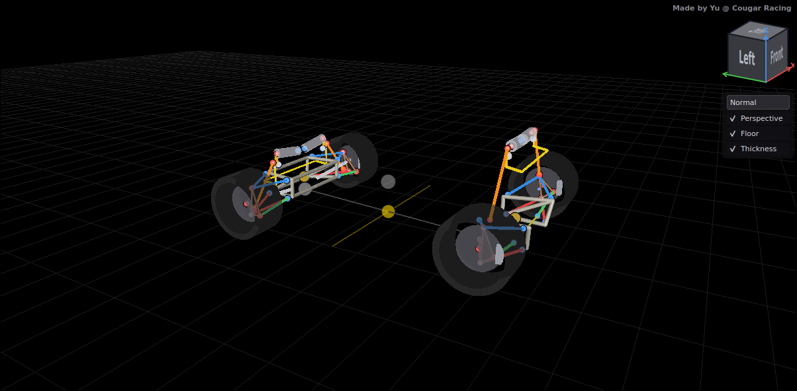 | 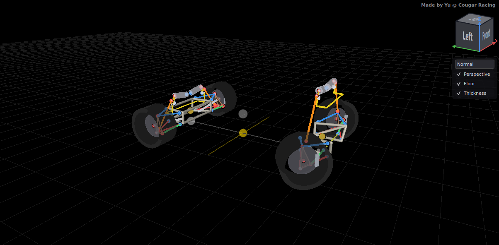 |

**Motion modes:** heave moves all four corners together; roll gives ±travel from the roll angle
and track; pitch opposes front and rear; steer re-solves the front corners at the rack travel
from the steering-wheel angle. Detail bodies hide while the slider moves and return on settle.

| Interference mode | Load mode |
|---|---|
| 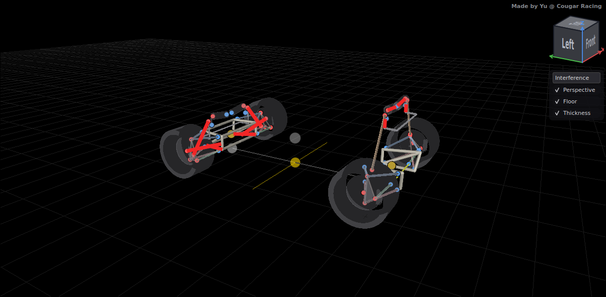 | 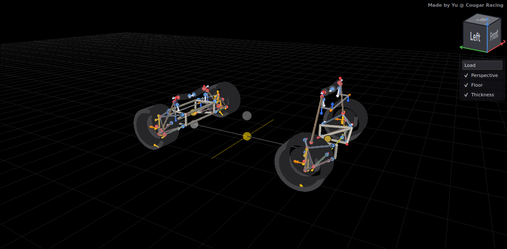 |

Interference mode colours every clashing member red (section [Clearance checks](#clearance-checks)).
Load mode draws the member and joint forces of the last dynamics solve as arrows; hover reads a
load.

## Kinematic graphs

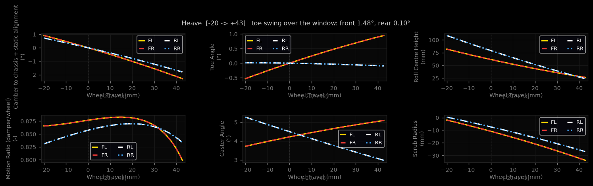

**What:** any of 38 metrics against wheel travel, roll angle, pitch travel or steering-wheel
angle, for the four corners.
**How:** each corner is solved at every station of the sweep. Solver: the four moving points
(UCA outer, LCA outer, tie-rod outer, wheel centre) satisfy 11 rigid-link distance equations
plus `wc_z = wc_z0 + travel`, solved by Newton–Raphson with an analytic Jacobian to 1e-10. The
rocker angle is a 1-D Newton solve about the actuation-plane normal; its branch follows
spring-length continuity. Sweeps re-run 150 ms after an edit; every curve is hover-readable and
right-click saves PNG/PDF/SVG.
**Metrics:** camber, toe, caster, KPI, rocker angle; scrub, trail, spring length, kingpin
length; roll-centre height and lateral position, instant centre, roll-axis inclination;
anti-dive, anti-squat, anti-lift; half-shaft length, separation and joint angle; wheel-centre
X/Y/Z; motion ratio; steer angle, Ackermann, turn radius; bar angle, drop travel and bar motion
ratio; third-spring and decoupled-spring lengths and ratios.
**Roll centre:** each arm plane is traced on the transverse plane through the wheel centre from
its pivot axis; the two traces meet at the front-view instant centre; the IC-to-patch lines of
both corners meet the centre plane. Sliding a pickup along its own axis does not move it.
**Shortcomings:** rigid links and upright, no compliance; the front-view camber metric is defined
at zero steer; parallel arms report a roll centre of zero.

| Roll | Pitch |
|---|---|
| 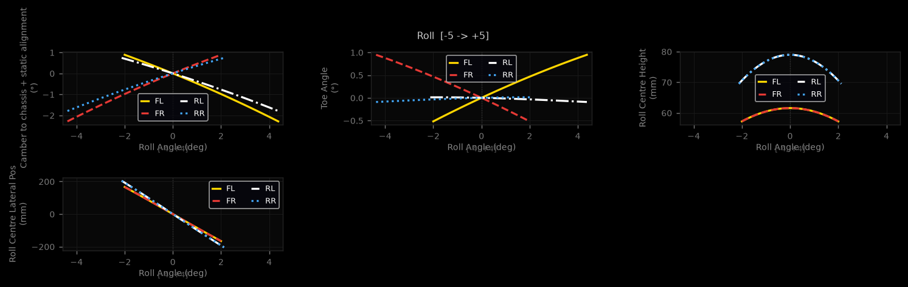 | 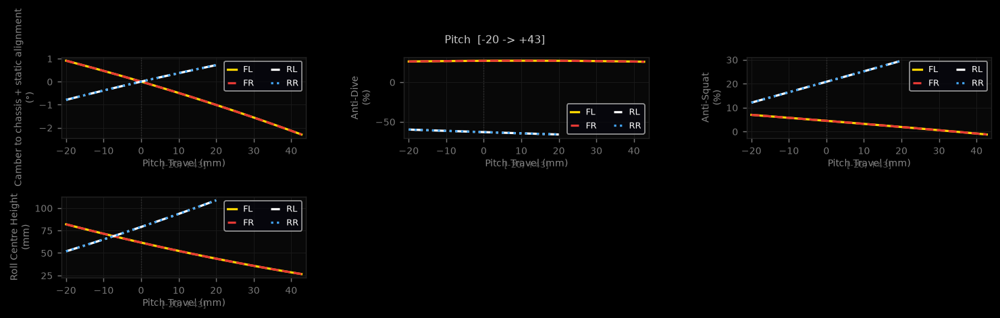 |

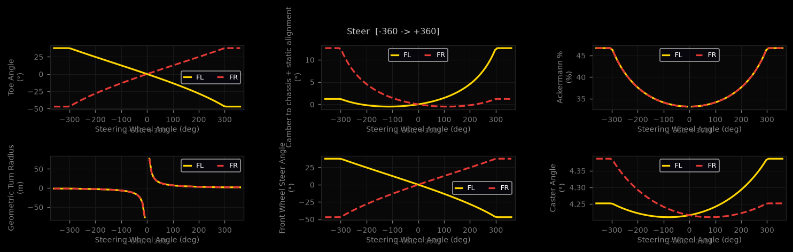

Steer sweeps run the steering chain of `vahan/steering.py`: wheel angle → rack travel (mm per
turn) → road-wheel angle from a probe of the corner solver, limited by the rack stroke. Live
Ackermann comes from the FL/FR pair.

## Side panels

| Motion | Steering | Alignment |
|---|---|---|
| 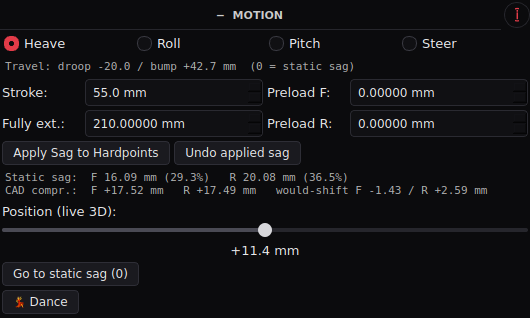 | 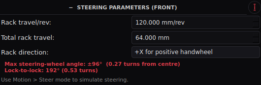 | 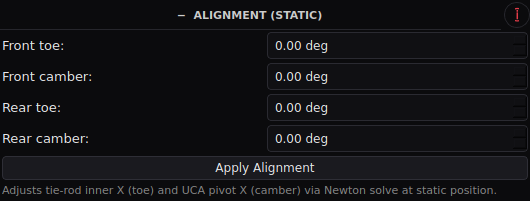 |

**Motion:** mode, shock stroke and fully-extended length, preload, the live-position slider,
*Apply Sag to Hardpoints* (re-zero the drawn model at static compression), *Undo applied sag*,
*Go to static sag*, *Dance* (animation). Travel range = stroke and preload through the motion
ratio. **Steering:** rack travel per wheel turn, total rack travel, direction. **Alignment:**
static toe and camber, applied after the solve as measurement offsets, not as hardpoint moves.

| Car parameters | Frame / interference | Graph picker | Hardpoint table |
|---|---|---|---|
| 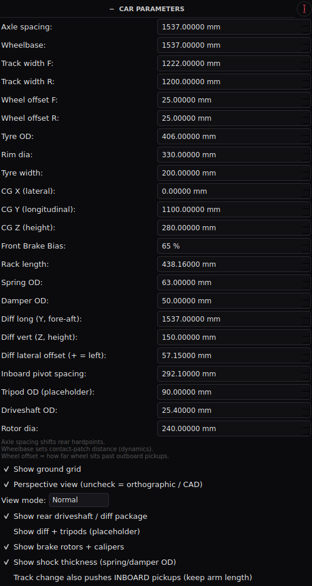 | 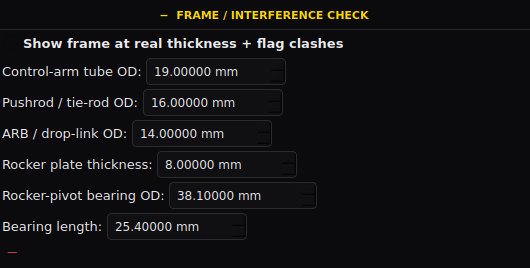 | 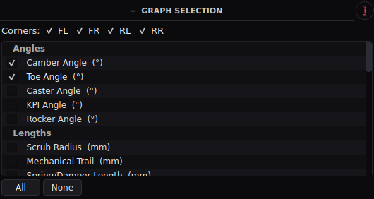 | 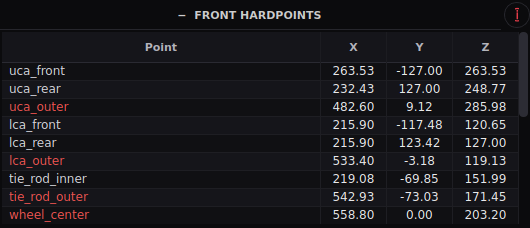 |

**Car parameters:** wheelbase and axle spacing, tracks, wheel offsets, tyre dimensions, CG,
rack length, spring and damper OD, view mode, ground, brakes, driveshaft, wheel-package corner.
Track and wheelbase changes move the outboard points; an option also moves the inboard pickups.
**Frame / interference:** draw members at thickness and highlight clashes and rocker-bearing
clearance. **Graph picker:** corners and metrics shown. **Hardpoint tables:** editable X/Y/Z
in mm, colour-coded by category.

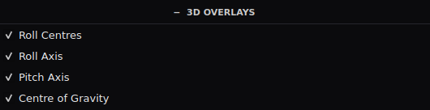

## Editing hardpoints

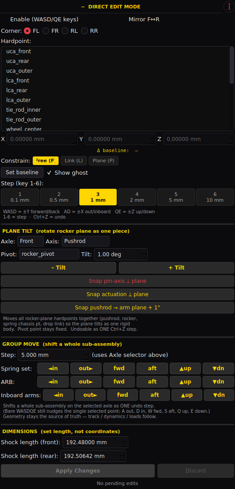

**What:** move points by typing, by keyboard nudge, as rigid groups, or by tilting a whole
actuation plane.
**How:** W/S ±Y, A/D ±X, Q/E ±Z with 0.1 to 10 mm steps (keys 1-6); Tab cycles the corner's
points; F/L/P constrain the move to free, along-the-link or in-plane. Mirror F↔R repeats the
delta on the other axle. *Set baseline* and *Show ghost* draw the starting geometry in grey with
a Δ readout. Plane tilt rotates the actuation set about pushrod, spring axis, rocker axis, plane
normal, drop link or X/Y/Z through a chosen pivot; snap buttons set the rocker axis
perpendicular to the plane, the chain into the plane and the pushrod onto the arm plane. Group
move shifts the spring set, bar or inboard arms by a step as one undo step. Ctrl+Z / Ctrl+Y.
**Shortcoming:** Apply commits and clears the undo history.

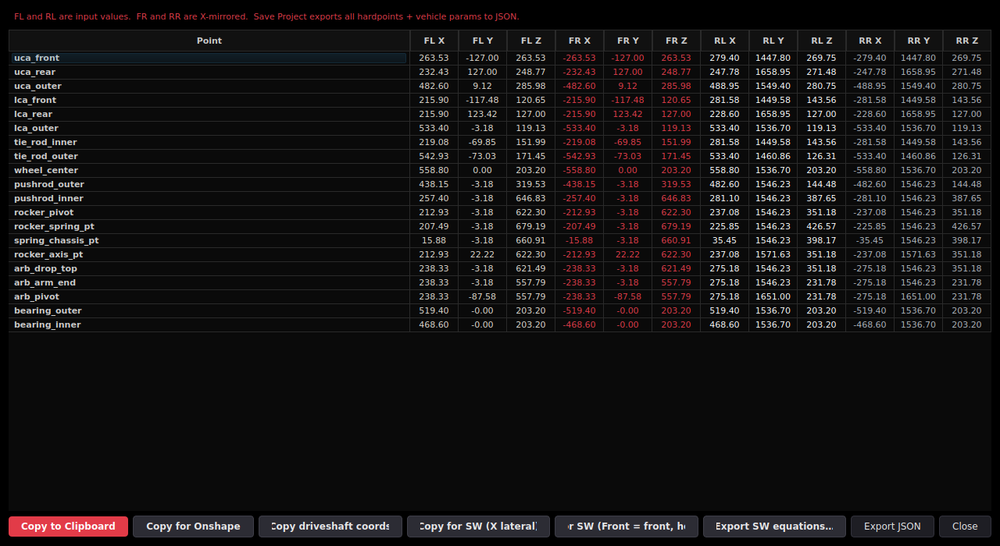

View → All Hardpoints: every point of every corner in mm, plus the CAD copy buttons
([Exports and CAD](#exports-and-cad)).

## Topologies

| Choice | Options |
|---|---|
| Damper actuation | direct, pushrod, pullrod |
| Damper mount | UCA, LCA, upright |
| Anti-roll device | bellcrank, control-arm drop link, T-bar, none |
| Spring configuration | corner springs, corner + heave third element on the T-bar, decoupled twin rockers |

Rejected: heave third element without a T-bar; decoupled with direct actuation; bellcrank bar
with direct actuation. File → Change Topology re-opens the pickers and reloads the corner
defaults. The net exercises seven cases: pushrod, pullrod, direct, control-arm bar, T-bar with
corner springs, decoupled, heave T-bar.

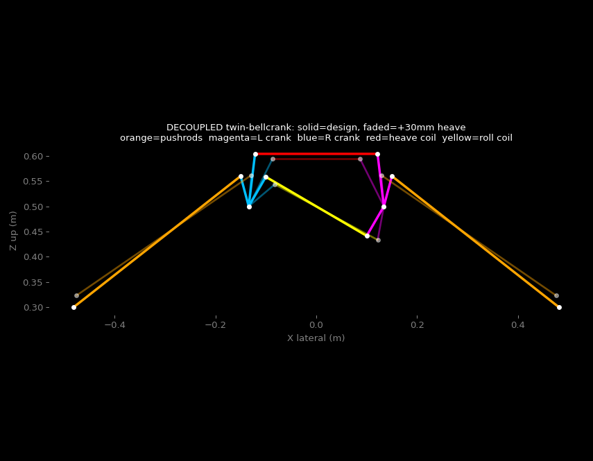

**Decoupled:** each pushrod drives its own bellcrank; a cross-car heave coilover and a cross-car
roll coilover separate the two modes. Solved as a 2-D Newton system in the two rocker angles
(`vahan/monoshock.py`); the wheel-rate matrix is finite-differenced. **Heave T-bar:** a third
coilover on the T-bar pivot (`vahan/heave_tbar.py`). **Shortcomings:** the ride model and the bar
graph metrics run for the default topology only; see the caveat at the top.

## Inverse kinematics

| Panel | Result |
|---|---|
| 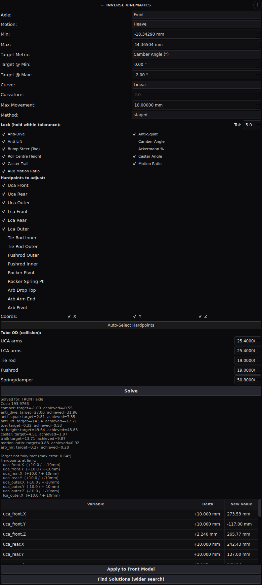 | 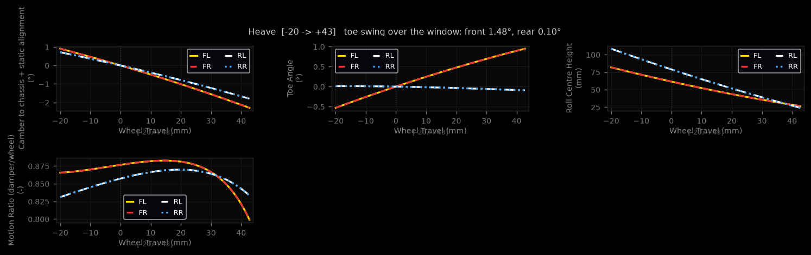 |

**What:** find hardpoints that produce a target metric curve while other metrics are held.
**How:** choose axle, motion, target metric and curve shape (linear, progressive, digressive,
exponential), the points and axes allowed to move, and a method. `staged` solves orthogonal
groups in turn (motion ratio → pushrod/rocker; toe → tie rod; anti geometry → inboard Y;
camber and roll centre → front-view X/Z; Ackermann → rack position) then polishes; `hybrid`
runs several Levenberg–Marquardt starts; `local`; `global` uses differential evolution. Cost =
Σ w_i (metric_i − target_i)² + regularisation + tube-collision penalty. *Find Solutions* widens the
bounds 2×, 4×, 7×, 10× and lists alternatives.
**Targets:** anti-dive, anti-squat, anti-lift, camber, bump steer, Ackermann, roll-centre height,
caster, caster trail, motion ratio, bar motion ratio.
**Shortcoming:** a solution satisfies the chosen metrics only; clearance and packaging rules are
checked afterwards, not inside the solve.

## Packaging

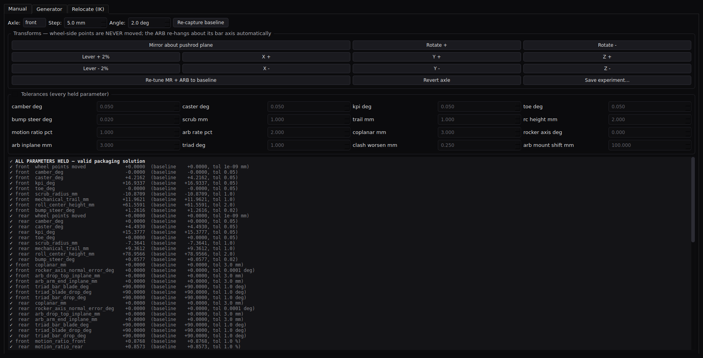

**What:** move the inboard actuation (rocker, coilover, bar) without changing the wheel curves.
**How:** *Manual* applies rigid isometries (mirror about the pushrod plane, rotate about the
pushrod line, translate, scale the rocker lever) and then re-tunes the motion ratio and bar rate
to the baseline. Every candidate goes through `packaging.validate`: wheel points unchanged,
camber/caster/KPI/toe within 0.05°, bump steer 0.02°, scrub and trail 1 mm, roll centre 2 mm,
motion ratio 1 %, bar rate 2 %, coplanarity 3 mm, rocker axis normal, drop link in plane 3 mm,
bar triad 1°, and a clash sweep at droop, static and bump that may worsen by at most 0.25 mm.
*Generator* samples candidates on a grid behind a keep-out plane. *Relocate* moves one point
while holding the curves: ray bisection in 26 directions, ellipsoid sampling, farthest-point
selection (`vahan/relocate.py`). Design City (Ctrl+3, `design_city.py`) enumerates alternatives
per axle, keeps those within 0.1 % on about 110 parameters, renders and clusters them.


**Shortcoming:** validity means "the model's curves are held", not that the part fits a real
chassis; chassis members are only modelled through the bay tubes and keep-out below.

## Clearance checks

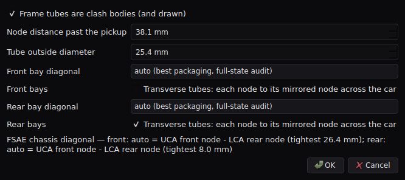

**What:** interference between members, rocker plate, bar, driveshaft, chassis tubes, keep-out
solid and the rim.
**How:** every member is a capsule (segment + radius); a pair clashes when centreline distance
minus both radii is below 1 mm within a corner or 3 mm across corners. Pairs sharing an endpoint
are skipped; the rear LCA and toe link count as one part. FSAE chassis bays: nodes 38.1 mm past
each pickup, 25.4 mm tubes, one diagonal per bay (auto picks the clearest), rear transverse
tubes, and the sprocket and differential from an imported STEP as fixed obstructions. Keep-out:
a planar STEP solid is a hard volume; the audit covers droop, static and bump at both locks.
Rim fit: joint centres against a clear circle, member bodies against the barrel, and the real
inner profile from the wheel maker's STEP, with a 3 mm margin. Rules are written in
`docs/suspension_rules/`.
**Shortcomings:** radii are declared constants (0.625 in tubes, 1 in ball joints, 1.5 in rocker
bearing, 0.315 in rod ends); keep-out solids must be planar; the rim profile treats spokes as a
solid disc.

## Steady-state dynamics

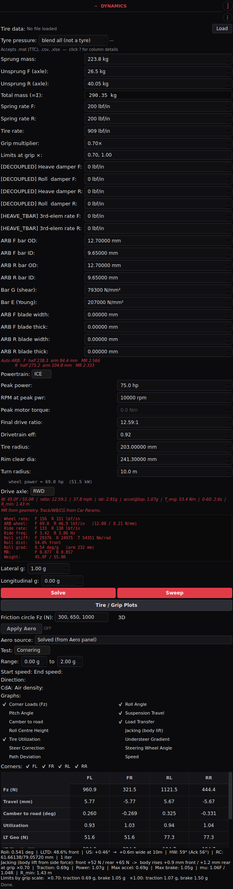

**What:** the car at a lateral and longitudinal g: per-corner Fz, travel, camber to road,
utilisation, roll, pitch, understeer gradient, load-transfer distribution, jacking.
**How:** iterate roll → per-corner travel → corner kinematic solve → roll-centre heights and
camber → load transfer → roll until Δroll < 0.002° (max 15 passes).

```
K_wheel = k·MR² + F_spring·dMR/dx          K_ride = 1 / (1/K_wheel + 1/K_tyre)
K_bar   = G·J/(A²·L)  in series with  3·E·I/A³   (torsion bar + blade bending, through the bar MR)
K_roll,axle = (K_wheel + K_bar)·t²/2
φ = m_s·a_y·h_arm / (K_roll − m_s·g·h_arm)
ΔF_axle = geometric (m_s·a_y·share·z_RC/t) + elastic (M_roll·K_axle/K_total/t) + unsprung (m_u·a_y·h_u/t)
LLTD = ΔF_front / (ΔF_front + ΔF_rear)
u = √(Fx² + Fy²) / (μ_peak(Fz, IA)·μ_scale·Fz)
```

Fy splits front/rear by yaw equilibrium and left/right by looking each wheel up in the tyre
surface. Anti-dive/-lift/-squat come from the kinematics; pitch travel per axle is the share of
longitudinal transfer that goes through the springs. Jacking force is reported per corner;
feeding it back into the kinematics is off by default. The grip multiplier scales every tyre
limit and is a user input.
**Shortcomings:** rigid chassis; unsprung CG at wheel-centre height; shift times and inertias are
inputs; no combined-slip tyre surface.

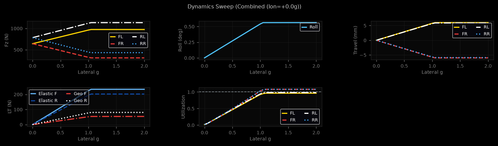

Sweeps over lateral g, longitudinal g, combined, speed and acceleration plot corner loads, roll,
travel, geometric vs elastic transfer and utilisation, with a secondary speed axis from the
turn radius.

## Tyre model

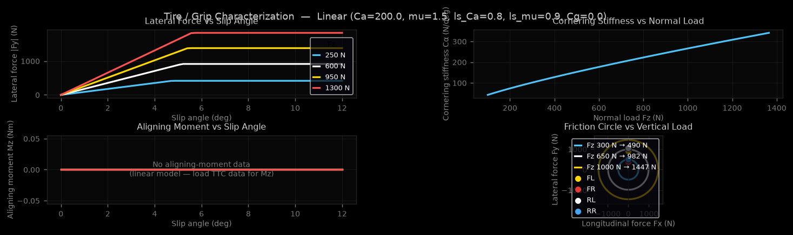

**What:** lateral force, aligning moment, cornering stiffness and friction circle from either a
measured surface or a parametric fallback.
**How:** `TireModel` builds Fy(SA, Fz, IA) and Mz surfaces from a TTC `.mat` or a CSV/XLSX with
SA, FZ, FY, IA columns: binned medians, cubic spline on a regular grid, a Magic-Formula peak-slip
line past which the force is clamped. One pressure must be chosen; an optional speed window
keeps one conditioning block. `LinearTireModel` is used when no file is loaded:
Cα(Fz) = Cα0·(Fz/Fz0)^ls, μ(Fz) = μ0·(Fz/Fz0)^(ls_μ−1), optional camber thrust, saturation at
μ·Fz. Front and rear tyres can differ.
**Shortcomings:** no tyre data ships with Vahan (TTC data is licensed to consortium members); no
transient tyre behaviour; extrapolation beyond the tested load and slip range is flagged, not
prevented.

## Aero targets

| Aero load targets | Sweep with aero applied |
|---|---|
| 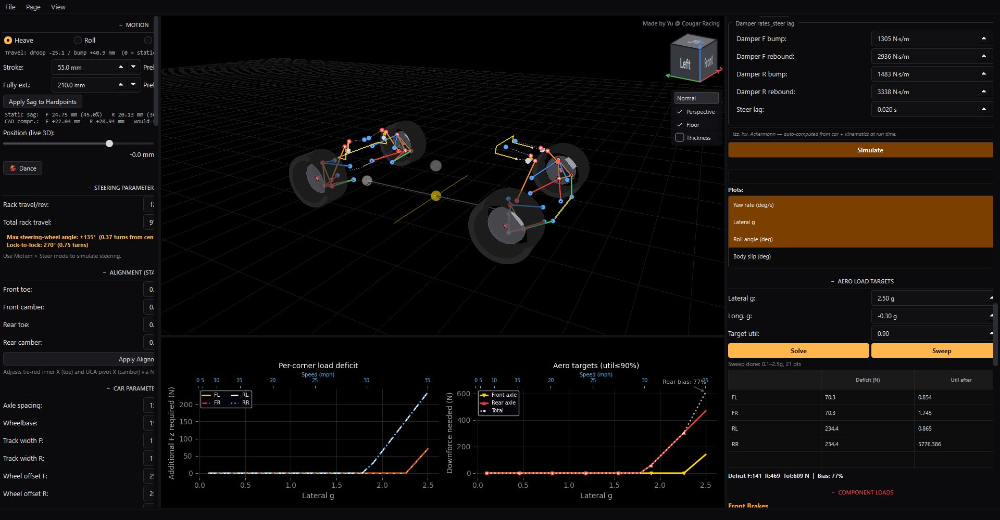 | 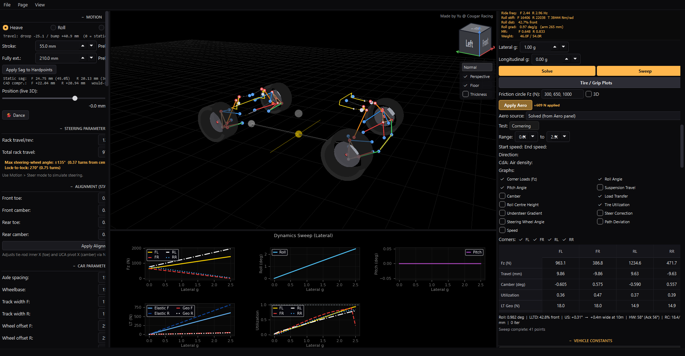 |

**What:** the downforce each corner needs to bring its utilisation to a target at a given g, and
the resulting front/rear split.
**How:** per-corner bisection on Fz with the nonlinear μ(Fz); axle need is packaged to the worse
corner. *Apply Aero* feeds the result back into the dynamics scaled with V² (F = ½ρ·C_L·A·V²,
split by centre of pressure), with aero sink through the heave curve; a custom input takes a
reference force, speed and CoP.
Both images above were computed with a measured tyre surface.
**Shortcomings:** no aerodynamic model of the car; the solver needs a measured tyre surface and
refuses the parametric fallback.

## Sensitivity

| Panel | Recommendation table (measured tyre) |
|---|---|
| 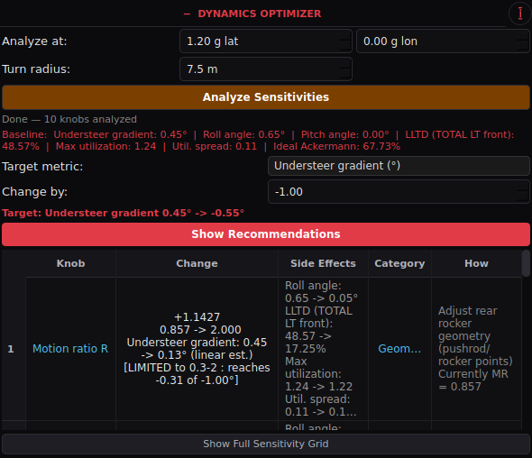 | 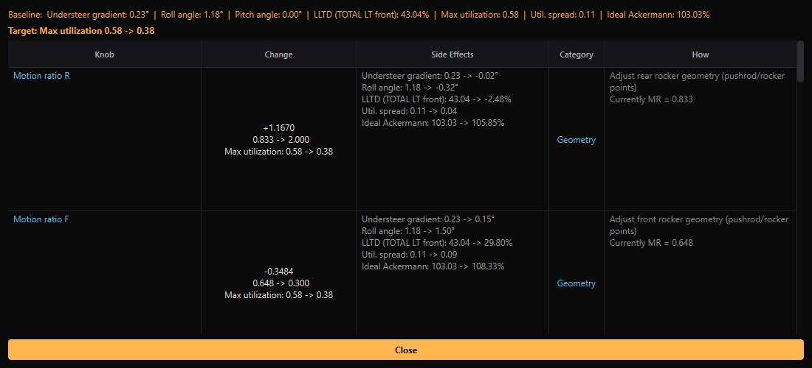 |

**What:** which input moves a chosen output, and by how much.
**How:** central finite differences of understeer gradient, roll, pitch, LLTD, utilisation and
ideal Ackermann with respect to springs, bars, CG, brake bias and motion ratio, using practical
steps (1 N/mm, 1 N·m/deg, 5 mm). The recommendation table lists the knobs that reach a target
change, with side effects, and clips a knob at its range.
**Shortcoming:** linear estimates around one operating point.

## Transient

| Skidpad / transient panel | Time histories |
|---|---|
| 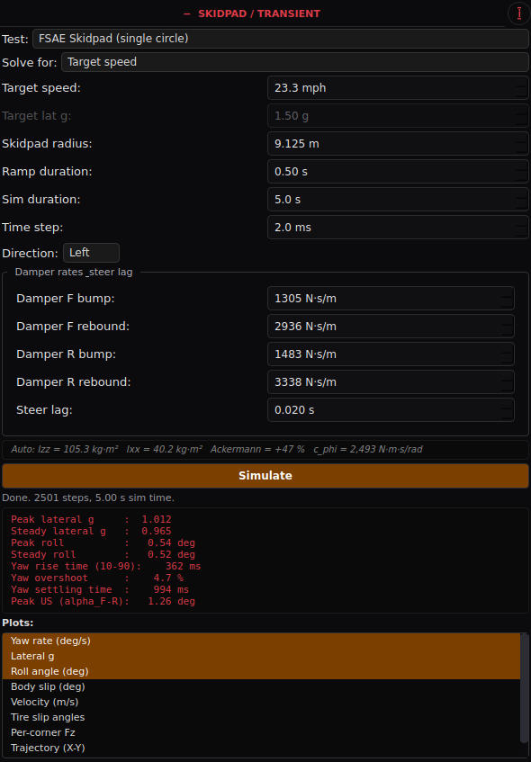 | 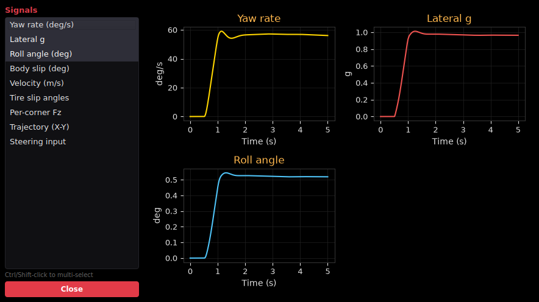 |

**What:** yaw-rate rise and settling, overshoot, peak and steady lateral g and roll for step,
ramp, sine and skidpad inputs.
**How:** a bicycle-plus-roll model integrated by RK4; states vx, vy, yaw rate, roll, roll rate,
X, Y, heading and the actual steer through a first-order lag (τ = 0.02 s default). Roll damping
c_φ = Σ_axle (c_bump + c_rebound)·MR²·t²/4 from the damper coefficients; yaw and roll inertia
estimated from the masses. Camber and roll-centre migration come from a 25-point travel lookup.
Skidpad uses a Stanley path follower; speed is held by a PI loop.
**Shortcomings:** no tyre relaxation length; longitudinal control is constant force; inertias are
estimates.

## Component loads

| 1.0 g lateral, parametric tyre | 2.5 g lateral + 0.3 g braking, measured tyre |
|---|---|
| 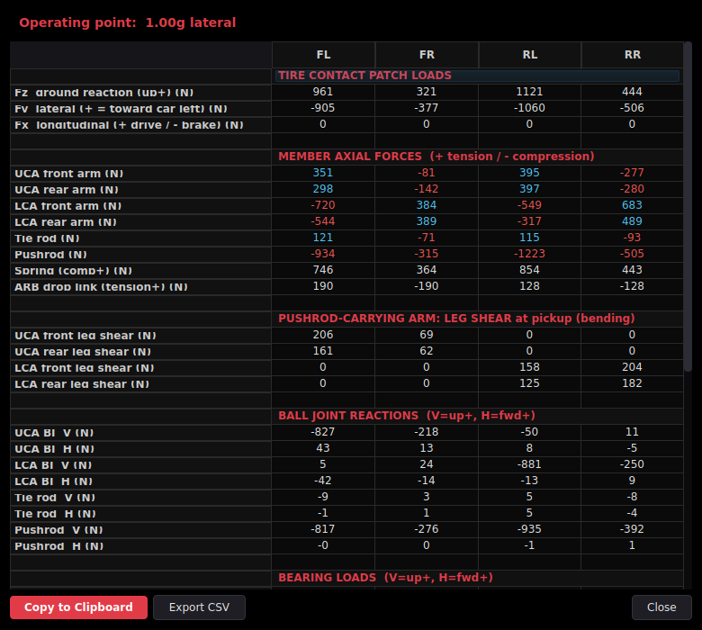 | 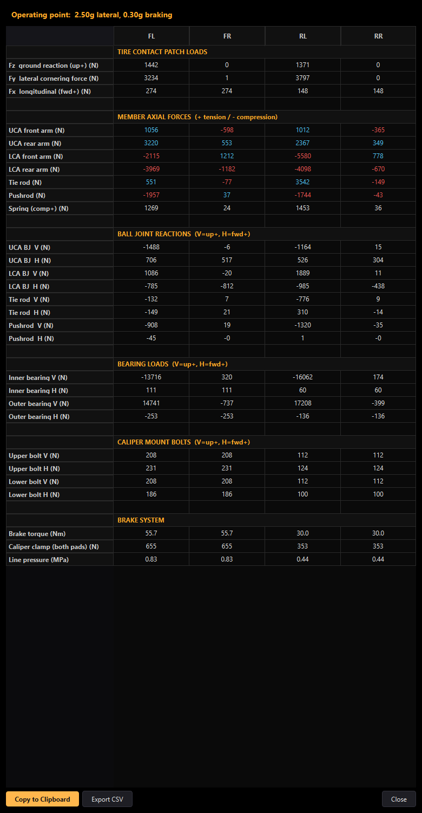 |

**What:** axial force in every link, leg shear, ball-joint V/H, wheel-bearing V/H, caliper-bolt
V/H, rocker and bar reactions, brake torque, clamp and line pressure at a chosen operating point.
**How:** the upright (wheel, hub, rotor, bearings, upright, caliper) is cut free with the patch
force, m_u·(g − a) at the wheel centre and the half-shaft torque; the six two-force members are
solved from ΣF = 0, ΣM = 0 (6×6). With the pushrod on an arm, an arm sub-solve carries a 3-D
ball-joint force and reports leg shear and bending. Condition number > 1e3 marks a result
invalid. Load cases: 2.0 g corner, 1.6 g brake, 1.0 g accel, 1.4 g + 1.0 g, or the current state;
cornering cases use the turn-radius speed, straight cases the aero reference speed.

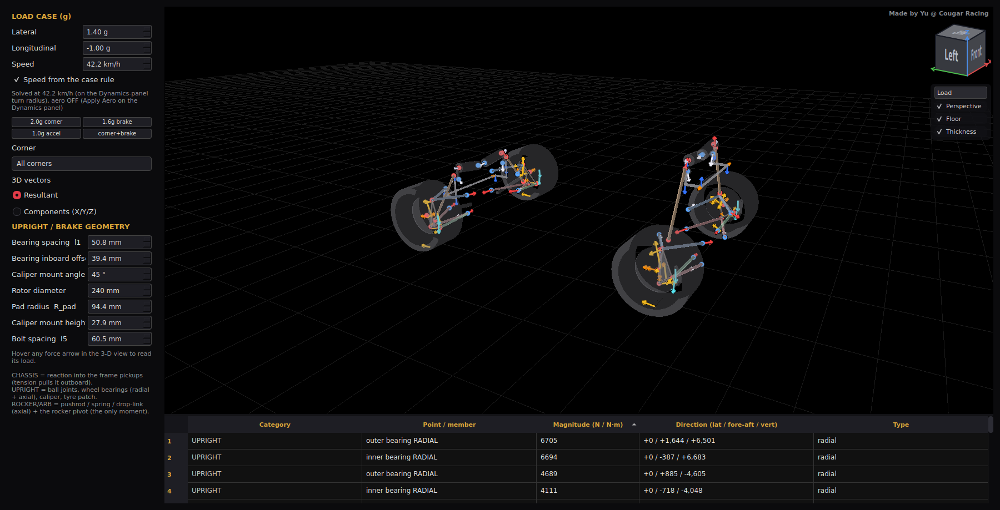

The Loads page draws the same solve as arrows and a sortable table; hover an arrow to read it.
**Shortcomings:** quasi-static (wheel I·α neglected), rigid geometry, a 1° road-normal tilt
neglected. The numbers are joint reactions for hand sizing or for boundary conditions in your
own FEA; there is no FEA export or solver.

## Brakes

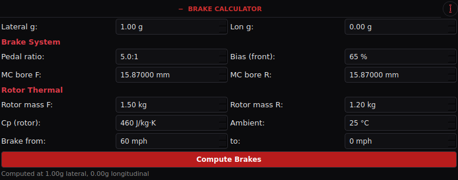

**What:** line pressure, caliper clamp, torque per wheel, lockup order and pedal force, and a
single-stop rotor temperature rise.
**How:** pedal ratio, master-cylinder bores and bias give pressure; torque = clamp × pad μ ×
effective radius; lockup when torque exceeds μ_peak·μ_scale·Fz·r at the solved wheel load.
Thermal: 100 % of the kinetic energy of one stop into the rotors, no cooling.
**Shortcoming:** lockup needs a tyre model; with the parametric fallback the braking
deceleration is not computed.

## Bearings

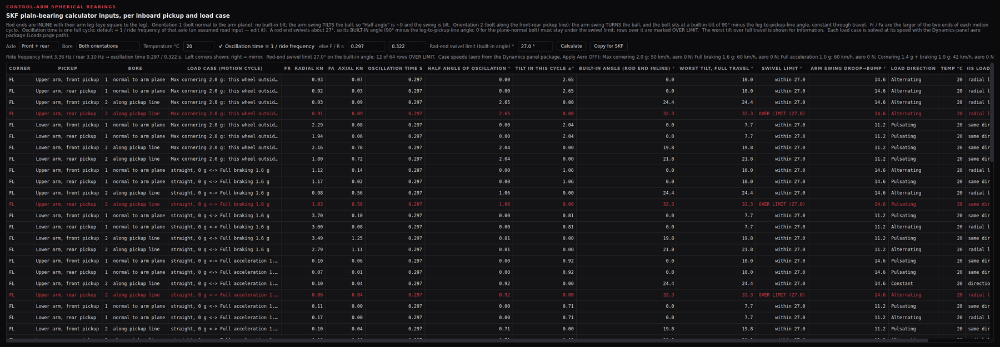

**What:** the inputs the SKF plain-bearing calculator asks for, per inboard pickup and load
case: radial and axial force, oscillation half-angle, oscillation time, load direction,
temperature, and the built-in rod-end tilt against a swivel limit.
**How:** the arm rotation over each motion cycle is split exactly into swing and twist for both
bolt orientations (normal to the arm plane: swing only; along the pivot line: twist with a
built-in tilt of 90° minus the leg-to-pivot angle). Default limit 27°, editable. Forces come
from the component-loads solve at each case's speed. *Copy for SKF* exports tab-separated rows.
**Shortcoming:** no bearing-life calculation; oscillation time defaults to 1 / ride frequency.

## Analysis plots

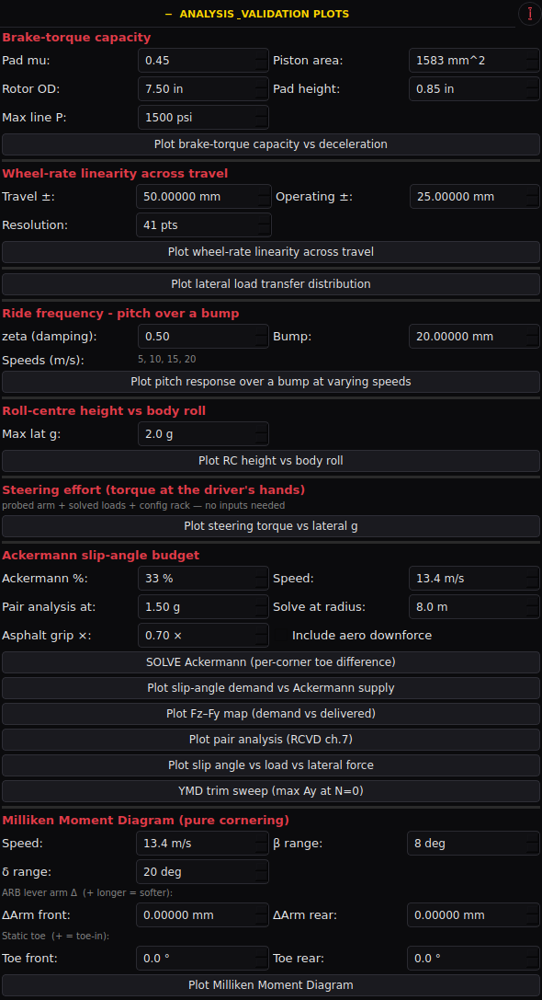

| Load transfer | Pitch over a bump |
|---|---|
| 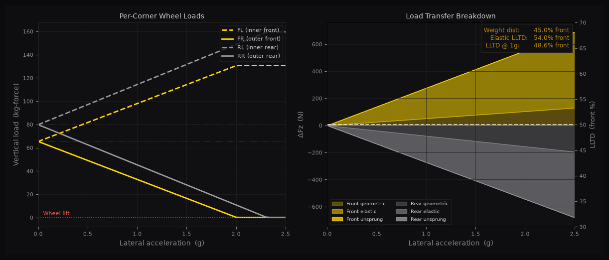 | 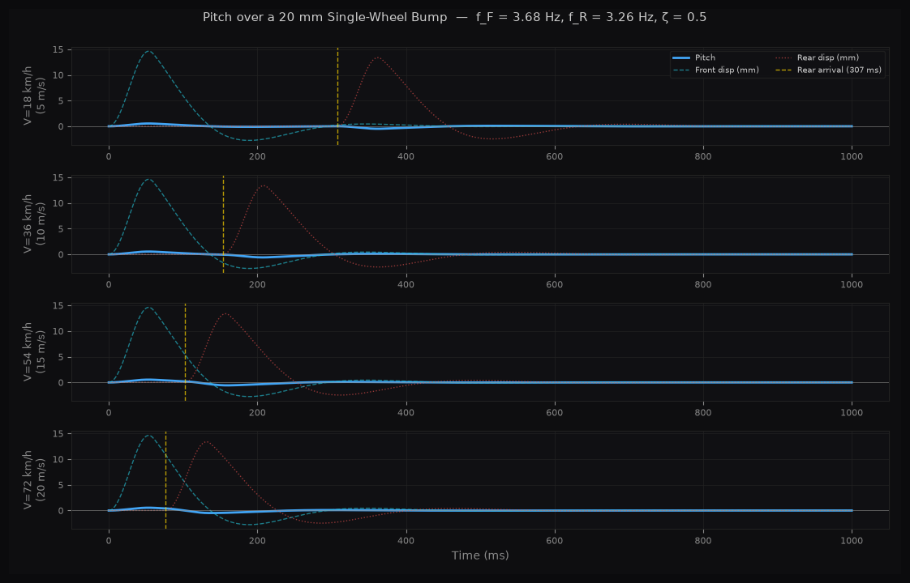 |

| Roll centre vs roll | Brake capacity | Wheel-rate linearity |
|---|---|---|
| 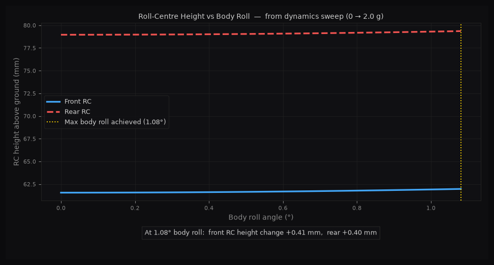 | 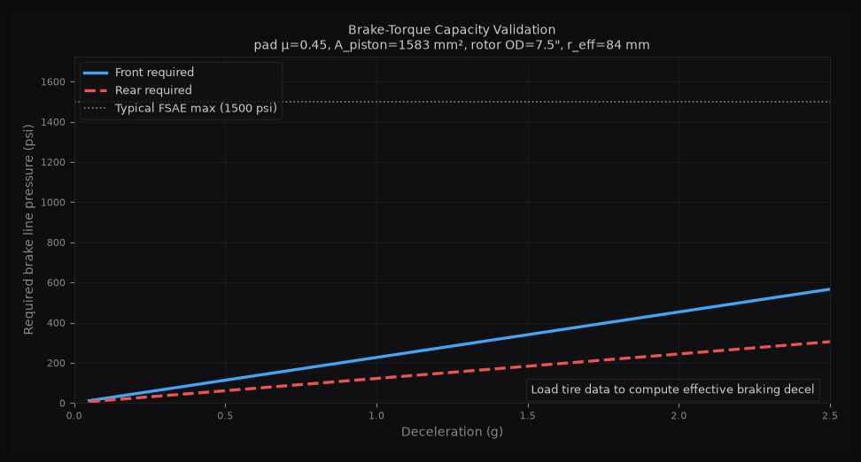 | 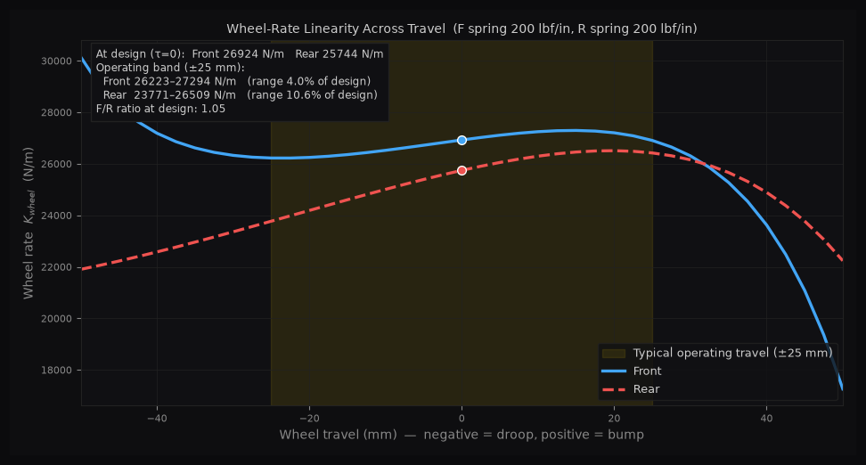 |

One-click figures from the live model: per-corner loads and the geometric / elastic / unsprung
transfer breakdown, pitch response to a single-wheel bump at four speeds (f_F, f_R from the ride
rates), roll-centre migration against body roll from the dynamics sweep, required line pressure
against deceleration, wheel-rate linearity. The Ackermann set, steering torque, yaw-moment and
MMD plots need a loaded tyre file.

## Ride

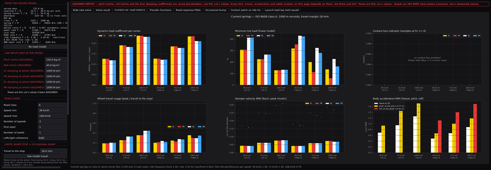

**What:** road response of the solved car and a ride-rate selection.
**How:** a linear 7-DOF model (heave, pitch, roll, four wheels), M·q̈ + C·q̇ + K·q = F(road), on
ISO 8608 class A or B synthetic roads, G(n) = G0·(n/n0)^−2 with G0 = 16e-6 or 64e-6 m³ at
0.1 cycles/m, random phases, wheelbase delay, selectable left/right coherence. Outputs per
corner: dynamic load coefficient DLC = RMS(Fz − mean)/mean, minimum tyre load, contact-loss
indicator, travel usage against the bump-stop margin, damper-velocity RMS and peak, body
acceleration RMS. Tabs also give transfer functions, road PSDs, an occasional half-sine bump,
contact-patch load against ride frequency and launch load lag.

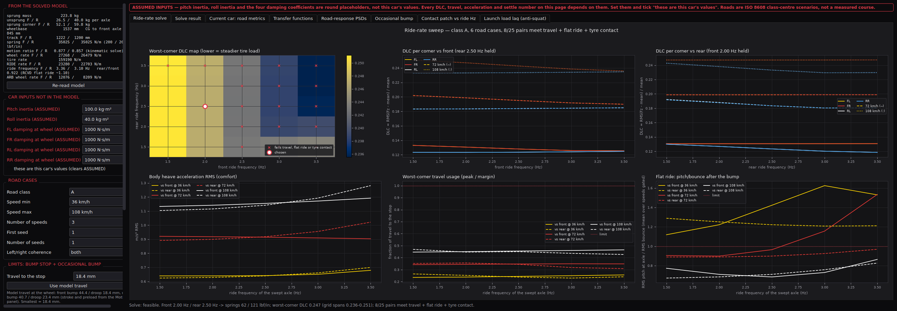

The solve sweeps a front × rear ride-frequency grid, keeps pairs that meet travel, flat-ride
and tyre-contact limits, picks the lowest worst-corner DLC and converts it to spring rates and
the nearest 25 lbf/in catalogue spring.
**Shortcomings:** standard topology only; pitch and roll inertia and the four damping
coefficients are placeholders until set; bump stops are not modelled; roads are scenarios, not
measured surfaces.

## Lap time

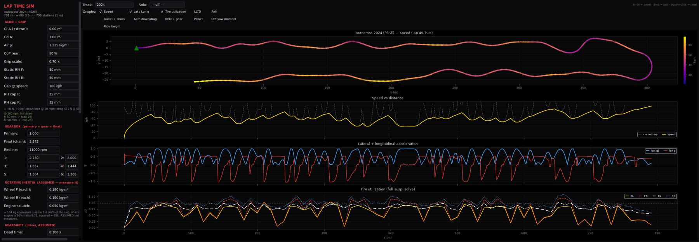

**What:** lap time, speed trace, accelerations, tyre utilisation, LLTD, roll, travel, aero, gear
and power along a digitised track.
**How:** quasi-steady, three passes: corner ceiling, forward acceleration, backward braking;
v = min of the three. The lateral ceiling is a grip table built by bisecting the full
steady-state solver to utilisation 1 at nine speeds, including the aero split; v_corner =
√(a_y·g·R). Powertrain: gear-resolved wheel force from the crank torque, rotating inertia as
equivalent mass, a shift model (torque cut, minimum interval, hysteresis). Tracks are JSON
centrelines in `tracks/`; `tools/trace_track.py` traces one from an image.
**Shortcomings:** no transient vehicle dynamics in the lap; braking is tyre-limited with no
brake-torque limit; rotating inertias and shift times are assumed.

## Engine

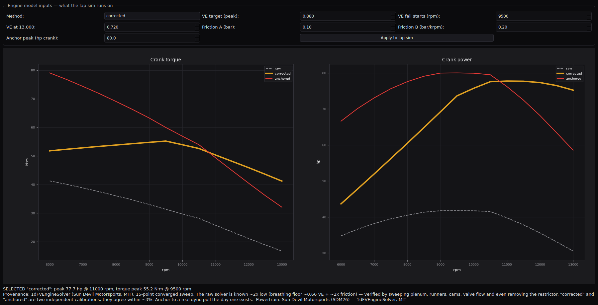

**What:** the torque and power curves the lap sim uses.
**How:** curves from a 1-D finite-volume engine simulation (1dFVEngineSolver, Sun Devil
Motorsports, MIT) with three calibrations: `raw`, `corrected` (volumetric-efficiency target plus
a friction line FMEP = A + B·rpm) and `anchored` (scaled to a stated crank peak).
`anchor_curve_to_dyno()` is for when a dyno pull exists.
**Shortcoming:** simulated, not dyno-validated; the raw curve is known to read about half the
expected level.

## Corner speed

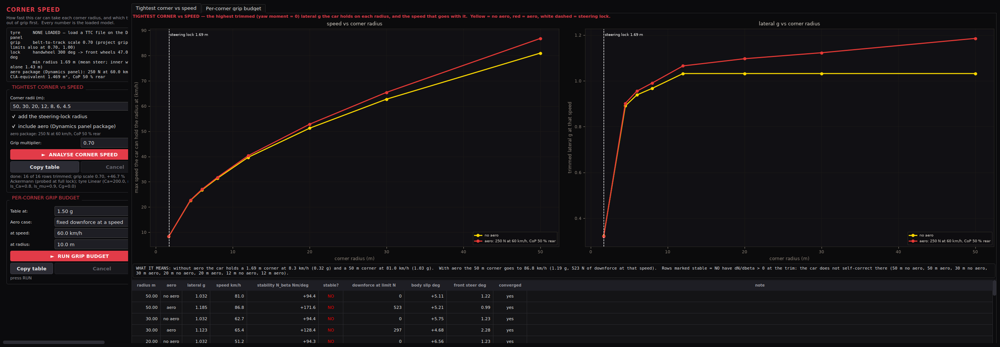

**What:** the highest trimmed lateral g and speed on each corner radius, with and without aero,
and the g at which the first single tyre runs out of grip.
**How:** at each radius the yaw-moment engine finds the trim (N = 0) with the as-built Ackermann;
V = √(a_y·g·R); the stability derivative dN/dβ is reported. The steering-lock radius comes from
the solved linkage at full rack. The grip-budget tab bisects on g until any corner's
utilisation exceeds 1.
**Shortcoming:** steady state only; with the parametric tyre the numbers describe the fallback
model, not a measured tyre.

## Ackermann and yaw moment

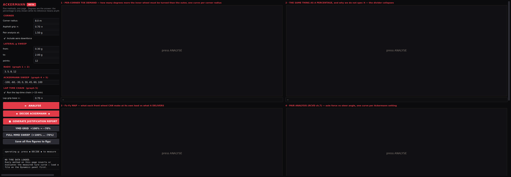

**What:** the Ackermann the tyres want and what each setting costs: per-corner toe demand, the
same as a percentage, the Fz–Fy map, pair analysis per setting, the lap-time effect, a YMD grid
and a full MMD sweep.
**How:** `vahan/ymd.py` is the single yaw-moment engine: a double-track model with per-wheel
loads from the steady-state solver, yaw-rate slip terms, static toe and the Ackermann split;
N = Σ(x·Fy − y·Fx) with aligning moment and induced drag; trim at N = 0; stability N_β and
control N_δ read at a sub-limit point. 0 % = parallel steer, 100 % = turn centre on the
rear-axle line, negative = reverse; an unqualified value is quoted at full lock. Steering effort
is by virtual work, M_kingpin × dδ/d(rack).
**Shortcomings:** every method on this page inverts a measured tyre surface, so it needs a loaded
tyre file (the page is shown before an analysis); the steering is rigid.

## Build tolerance

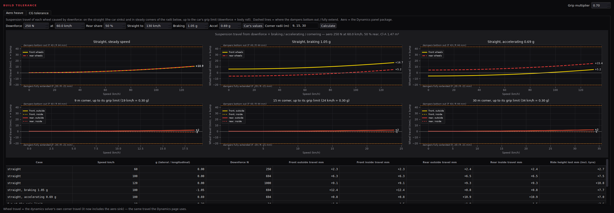

**What:** suspension travel from downforce on the straight and in corners against speed, and
the CG band within which each handling metric stays inside its allowance.
**How:** the aero tab runs the dynamics solver with the aero load at each speed (sink through the
heave curve) and marks damper bottom-out and full extension. The CG tab sweeps CG height or
fore-aft position over a span, rebuilds the solver and lap sim at each step, and reports where
grip limit, front LLTD share, roll per g, understeer, traction, braking and lap time cross their
allowance, with the slope per 10 mm.
**Shortcoming:** deterministic one-axis sweeps; hardpoint tolerances are not swept.

## Exports and CAD

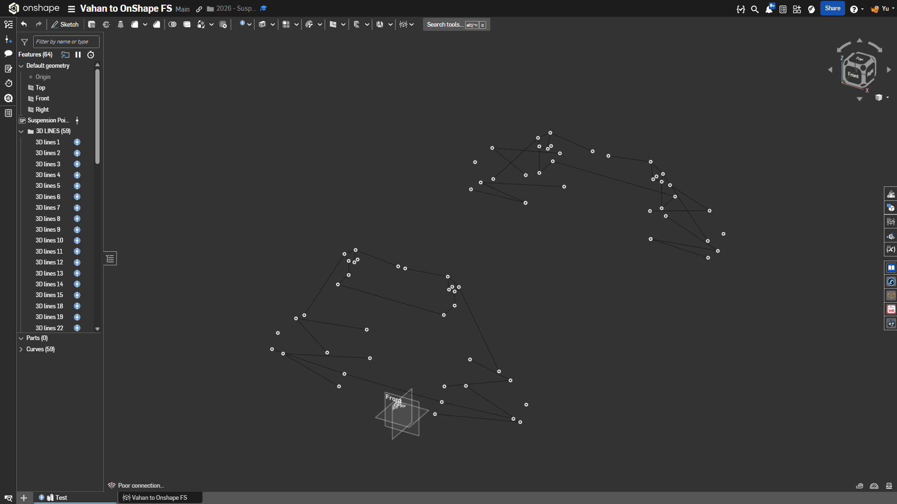

- **Onshape:** All Hardpoints → *Copy for Onshape*; the bundled `VahanHardpoints.fs`
  FeatureScript turns the text into labelled construction points per corner.
  `docs/ONSHAPE_TO_SOLIDWORKS.md` describes the STEP route to SolidWorks.
- **SolidWorks:** *Copy for SW* (two frames) and *Export SW equations*; `tools/sw_link.py`
  drives a 3-D sketch through pywin32 and has no recorded test against a running SolidWorks.
  For a live SolidWorks part use the companion tool
  [vahan-to-solidworks](https://github.com/the-vedantin/vahan-to-solidworks): a C# COM-API
  utility that takes the *Copy for SW* paste format (`name,FLx,FLy,FLz,...|...`, mm) and moves
  the existing sketch points in place, so entity IDs and every downstream reference survive.
- **STEP import:** a differential or engine solid becomes a clearance body (cascadio + trimesh);
  move, flip, recolour, write back out (cadquery-ocp).
- **Reports:** Export Report (`.docx`: parameters, kinematics, cornering, acceleration, braking,
  loads), Engineering Review (Markdown), Export Sweep Data (CSV), graph images, loads CSV,
  bearings and corner-speed tables, `capture_views.py` renders.
- **MCP server:** with the `mcp` package the running app serves `status`, `load_config`,
  `get_hardpoints`, `set_hardpoint`, `axle_metrics`, `relocate`, `hoopline`, `screenshot` and
  others on 127.0.0.1:8765 (`VAHAN_MCP=0` disables).

## Project files

A project is one JSON file (`.vahan`, version 3): hardpoint blocks in metres, topology extras,
car, steering and alignment, topology, motion settings, the dynamics / skidpad / loads / aero /
brake panel state, imported STEP meshes, sag backup. Saves are atomic (temp file, validate,
swap); loads are validated first and roll back on failure; older files load with defaults.
Design iterations are numbered files `configs/2027_v<N>_(what_changed).vahan`; the net and
Design City use the highest number, `VAHAN_DESIGN=<path>` overrides. No in-app diff or merge.

## Testing

`python test_one_model.py` runs the regression net offscreen (Python 3.12+). Each block prints
`pass`, `UNEXPECTED FAIL` or `KNOWN-FAIL: <reason>`; the exit code is the number of unexpected
failures. About 100 blocks cover packaging rules, clearance, kinematic signs, tyre-model
consistency, Ackermann and yaw-moment solvers, brakes, sag, dampers, save and load, load
transfer, member loads, bearings, jacking, corner speed, build tolerance and the seven topology
cases. It is a check against regressions, not a validation of the physics. Most design-level
blocks need a design file and some need a tyre file; a run with neither (2026-10-03) ended with
19 unexpected failures, all in blocks that could not open a design file, and all seven topology
cases passing. Other tests: `test_dynamics_camber*.py`, `test_ride.py`,
`test_road_plane_camber.py`, `test_rule04_strict.py`, `test_double_shear_rocker.py`,
`test_pushrod_envelope.py`, `test_steering_direction.py`, `test_redesign_review.py`,
`test_tire_selection_provenance.py` (needs a tyre file), `super_smoke.py`.

## Development

```
app.py      entry point
vahan/      computation, no Qt: solver, kinematics, metrics_catalog, topology, optimizer,
            packaging, relocate, interference, chassis, keepout, wheel_profile,
            spherical_bearings, dynamics, tire_model, ymd, ackermann, loads, ride, road,
            transient, laptime, engine, acceleration, corner_speed, differential, driveshaft,
            cg_tolerance, report_gen, analysis_plots, step_import
gui/        PyQt6: main_window.py, panels.py, view3d.py, one module per page, dialogs, mcp_server.py
docs/       design notes, GUI task list, suspension rules
tools/      SolidWorks bridge, track tracing, screenshot generation
tracks/     lap-sim centrelines
```

Physics lives in `vahan/`; pages call it and plot. `gui/main_window.py` and `gui/panels.py` are
large; search for `class` and `def`. A solver fix comes with a net check; an unfixed issue is a
KNOWN-FAIL with its reason. Headless analysis runs through the app (MainWindow offscreen or the
MCP server). Colours follow a colour-blind-safe palette (yellow, red, white, blue; no red/green
or purple/blue pairs, `docs/DESIGN.md`). Backlog: `docs/GUI_TASKS.md`, `docs/ROADMAP.md`.

Troubleshooting: `libEGL.so.1` missing → `apt-get install libegl1 libopengl0`; f-string
`SyntaxError` in the net → Python 3.12+; many UNEXPECTED FAILs → no design file; STEP import
disabled → `pip install cascadio trimesh`; "blend all (not a tyre)" → pick one pressure in the
Dynamics panel; port 8765 busy → `VAHAN_MCP_PORT` or `VAHAN_MCP=0`.

## Credits and license

- Vahan was written by Yu at Cougar Racing and is released under the MIT License
  ([`LICENSE`](LICENSE), Copyright (c) 2026 Cougar Racing). Engine curves are generated with
  [1dFVEngineSolver](https://github.com/NIXELFi/1dFVEngineSolver) (Sun Devil Motorsports, MIT).
  Provided as is; the user assumes all risk for component failures, incorrect calculations or
  faulty data.
